# Guide Utilisateur Complet avec Captures d'écran

Ce fichier propose une présentation détaillée de chaque fonctionnalité de l'application, en illustrant le fonctionnement de chaque interface ainsi que les processus techniques sous-jacents.

---

## 1. Système d'authentification

### Page de connexion

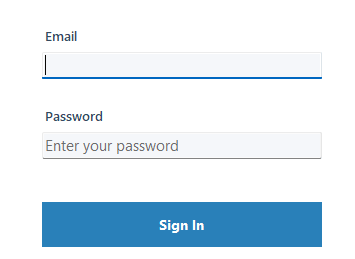

#### Vue d'ensemble
La page de connexion est le point d'entrée de l'application. Elle met en œuvre une authentification sécurisée avec routage selon le rôle. Ce formulaire valide les identifiants de l'utilisateur en interrogeant la base de données MySQL avec des mots de passe hachés en SHA-256.

#### Implémentation technique

**Composants du formulaire :**
- **Champ Email** : Accepte l'adresse email de l'utilisateur (identifiant unique en base)
- **Champ Mot de passe** : Champ texte masqué pour une saisie sécurisée
- **Bouton Se connecter** : Déclenche le processus d'authentification
- **Lien Réinitialiser le mot de passe** : Redirige vers l'interface de réinitialisation
- **Lien GitHub** : Ouvre le dépôt du projet dans le navigateur par défaut

**Flux d'authentification :**

1. **Capture des saisies** : Quand l'utilisateur saisit ses identifiants et clique sur « Se connecter », le formulaire récupère l'email et le mot de passe.

2. **Exécution de la requête** : Le système exécute la requête paramétrée suivante via `UserDAO.Login()` :
   ```sql
   SELECT * FROM User
   WHERE email = @email AND password = SHA2(@password, 256);
   ```

3. **Hachage du mot de passe** : Le mot de passe est haché en SHA-256 au niveau de la base de données, garantissant que le mot de passe en clair n'existe jamais dans la base.

4. **Routage selon le rôle** : Une fois l'authentification réussie, l'application vérifie le rôle de l'utilisateur :
   - **Si Role = true (Admin)** : Redirige vers [AdminForm](#3-interface-administrateur) avec les fonctionnalités complètes de gestion des utilisateurs
   - **Si Role = false (Médecin)** : Redirige vers [DoctorForm](#2-interface-médecin) avec la gestion des patients et des ordonnances

5. **Gestion des erreurs** : Si l'authentification échoue, un message d'erreur s'affiche : « Email ou mot de passe invalide »

**Fonctionnalités de sécurité :**
- Les requêtes paramétrées préviennent les attaques par injection SQL
- Le hachage SHA-256 protège les mots de passe (hash stocké : chaîne hexadécimale de 64 caractères)
- Les tentatives de connexion échouées affichent des messages d'erreur génériques (aucune indication précisant si c'est l'email ou le mot de passe qui est incorrect)
- Le champ mot de passe utilise la propriété `UseSystemPasswordChar` pour le masquage visuel

**Emplacement du code** : [Forms/MainForm.cs:45-67](Forms/MainForm.cs#L45-L67)

---

### Page de réinitialisation du mot de passe

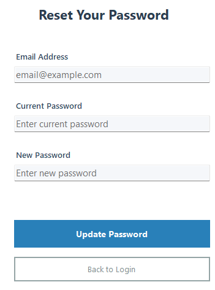

#### Vue d'ensemble
L'interface de réinitialisation du mot de passe permet aux utilisateurs de gérer eux-mêmes leur mot de passe. Ce formulaire met en œuvre des mises à jour de mot de passe sécurisées, en exigeant la vérification du mot de passe actuel avant toute modification.

#### Implémentation technique

**Composants du formulaire :**
- **Champ Email** : Email de l'utilisateur (identifiant unique)
- **Champ Mot de passe actuel** : Champ de vérification permettant d'authentifier la demande de changement
- **Champ Nouveau mot de passe** : Le nouveau mot de passe souhaité
- **Bouton Mettre à jour le mot de passe** : Déclenche le processus de changement
- **Bouton Retour à la connexion** : Retourne à l'écran de connexion sans modification

**Processus de mise à jour du mot de passe :**

1. **Validation des saisies** : Le formulaire vérifie que les trois champs sont renseignés avant de continuer.

2. **Vérification d'identité** : Le système vérifie d'abord l'identité de l'utilisateur en contrôlant l'email et le mot de passe actuel :
   ```sql
   SELECT * FROM User
   WHERE email = @email AND password = SHA2(@oldpassword, 256);
   ```

3. **Exécution de la mise à jour** : Si la vérification réussit, la méthode `UserDAO.UpdatePassword()` exécute :
   ```sql
   UPDATE User
   SET password = SHA2(@newpassword, 256)
   WHERE email = @email AND password = SHA2(@oldpassword, 256);
   ```

4. **Opération atomique** : La mise à jour utilise une clause WHERE qui inclut à la fois l'email et le hash de l'ancien mot de passe, garantissant que le mot de passe ne peut être modifié que si les identifiants courants sont valides.

5. **Retour de succès** : En cas de mise à jour réussie :
   - Un message de succès s'affiche : « Mot de passe mis à jour avec succès »
   - Le formulaire se ferme automatiquement et retourne à l'écran de connexion
   - L'utilisateur doit se reconnecter avec le nouveau mot de passe

6. **Scénarios d'erreur** :
   - **Mot de passe actuel incorrect** : « Le mot de passe actuel est incorrect »
   - **Erreur de connexion à la base** : « Erreur lors de la mise à jour du mot de passe : [détails de l'erreur] »
   - **Champs vides** : « Tous les champs sont obligatoires »

**Considérations de sécurité :**
- Exige la connaissance du mot de passe actuel (empêche tout changement non autorisé si la session reste déverrouillée)
- Le nouveau mot de passe est immédiatement haché en SHA-256 avant le stockage en base
- Aucune contrainte de complexité n'est imposée (point d'amélioration potentiel)
- Pas de champ de confirmation du mot de passe (accepte n'importe quelle saisie)

**Fonctionnalités d'expérience utilisateur :**
- Interface épurée et minimale avec étiquetage clair
- Boutons à code couleur (bleu pour l'action principale, blanc pour l'action secondaire)
- Le champ email utilise un texte indicatif (placeholder)
- Prise en charge de la touche Entrée pour soumettre rapidement le formulaire

**Emplacement du code** : [Forms/PasswordForm.cs:23-58](Forms/PasswordForm.cs#L23-L58)

---

## 2. Interface Médecin

L'interface Médecin se compose de trois onglets principaux accessibles via le `DoctorForm` : Médicaments, Patients et Ordonnances. Cette interface à onglets fournit une gestion complète du flux de travail du médecin.

---

### Gestion des médicaments

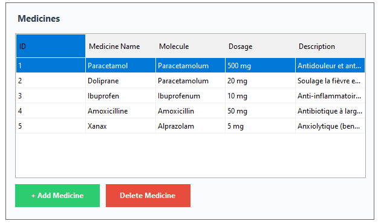

#### Vue d'ensemble
L'onglet Médicaments fournit un système complet de gestion de catalogue pour les produits pharmaceutiques. Les médecins peuvent consulter, créer, modifier et supprimer des entrées de médicaments avec des informations détaillées incluant les molécules actives, dosages et descriptions.

#### Implémentation technique

**Configuration du DataGridView :**
- **Colonnes affichées** :
  - `ID` : Clé primaire auto-incrémentée (lecture seule, affichée pour référence)
  - `Nom du médicament` : Nom commercial du médicament (obligatoire, max 150 caractères)
  - `Molécule` : Principe actif pharmaceutique (optionnel, max 150 caractères)
  - `Dosage` : Force/concentration (obligatoire, max 100 caractères)
  - `Description` : Informations thérapeutiques (optionnel, champ TEXT)

- **Propriétés de la grille** :
  - `ReadOnly = false` : Autorise l'édition en ligne des médicaments existants
  - `AllowUserToAddRows = false` : Les nouveaux médicaments doivent être créés via le bouton « + Ajouter un médicament »
  - `AllowUserToDeleteRows = false` : La suppression est contrôlée via le bouton « Supprimer le médicament »
  - `SelectionMode = FullRowSelect` : La ligne entière est mise en évidence au clic

**Fonctionnalités clés :**

**1. Édition en ligne**
- **Double-cliquez sur n'importe quelle cellule** pour passer en mode édition
- Les modifications s'appliquent en temps réel à la sortie de la cellule
- À la fin de l'édition d'une cellule (événement `CellEndEdit`), le système :
  1. Récupère les valeurs mises à jour de la ligne entière
  2. Crée un objet `Medicine` avec les nouvelles données
  3. Exécute `MedicineDAO.Update(medicine, currentUserId)` avec le SQL suivant :
     ```sql
     UPDATE Medicine
     SET name = @name,
         molecule = @molecule,
         dosage = @dosage,
         description = @description,
         id_user = @id_user
     WHERE id_medicine = @id_medicine;
     ```
  4. Affiche un message de succès : « Médicament mis à jour avec succès »
  5. Rafraîchit la grille pour afficher les données mises à jour

**2. Double-clic pour vue détaillée**
- Le double-clic sur une ligne déclenche l'événement `CellDoubleClick`
- Configuré actuellement pour passer en mode édition pour des mises à jour rapides
- Utile pour consulter les longues descriptions qui peuvent être tronquées dans la grille

**3. Ajouter un nouveau médicament**
- Cliquer sur le bouton vert **« + Ajouter un médicament »** ouvre le [Formulaire de création de médicament](#-formulaire-de-création-de-médicament)
- Le formulaire de création est une boîte de dialogue modale qui requiert :
  - Nom du médicament (obligatoire)
  - Molécule (obligatoire)
  - Dosage (obligatoire)
  - Description (optionnel)
- Une fois créé, le nouveau médicament est associé au médecin actuellement connecté (clé étrangère `id_user`)
- La grille se rafraîchit automatiquement pour afficher le nouveau médicament

**4. Supprimer un médicament**
- Sélectionnez une ligne médicament en cliquant dessus
- Cliquez sur le bouton rouge **« Supprimer le médicament »**
- Une boîte de dialogue de confirmation apparaît : « Êtes-vous sûr de vouloir supprimer ce médicament ? »
- En cas de confirmation, le système :
  1. Exécute `MedicineDAO.Delete(medicineId)` :
     ```sql
     DELETE FROM Medicine WHERE id_medicine = @id_medicine;
     ```
  2. Suppression en cascade de toutes les références dans la table `Appartient` (médicaments dans les ordonnances)
  3. Affiche un message de succès
  4. Rafraîchit la grille

**Flux de données :**

```
Action utilisateur → Gestionnaire d'événement → Méthode DAO → Requête SQL → Base MySQL
                                                                                ↓
Retour utilisateur ← Message succès/erreur ← Résultat ← Exécution de la requête
```

**Exemple de données affichées :**
- **Paracetamol** : Paracetamolum, 500 mg - « Antidouleur et ant... »
- **Doliprane** : Paracetamolum, 20 mg - « Soulage la fièvre e... »
- **Ibuprofen** : Ibuprofenum, 10 mg - « Anti-inflammatoir... »
- **Amoxicilline** : Amoxicillin, 50 mg - « Antibiotique à larg... »
- **Xanax** : Alprazolam, 5 mg - « Anxiolytique (ben... »

**Détails techniques :**
- Tous les médicaments sont chargés via `MedicineDAO.GetAll()`, qui effectue une JOIN avec la table User pour inclure les informations du créateur
- La grille utilise une liaison de données avec `BindingList<Medicine>` pour les mises à jour automatiques de l'UI
- Les largeurs de colonnes sont automatiquement ajustées en fonction du contenu via `AutoSizeColumnsMode`
- Les propriétés de navigation (`User`, `Appartients`) sont masquées de la grille via les paramètres de visibilité des colonnes

**Emplacement du code** : [Forms/DoctorForm.cs:156-243](Forms/DoctorForm.cs#L156-L243)

---

### Formulaire de création de médicament

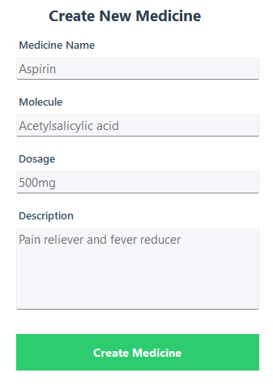

#### Vue d'ensemble
Le formulaire de création de médicament est une boîte de dialogue modale qui fournit une interface claire et focalisée pour ajouter de nouvelles entrées pharmaceutiques à la base de données. Ce formulaire implémente une validation complète et une navigation clavier conviviale.

#### Implémentation technique

**Composants du formulaire :**
- **Champ Nom du médicament** : Entrée texte pour le nom commercial (obligatoire, max 150 caractères)
- **Champ Molécule** : Entrée texte pour le principe actif pharmaceutique (obligatoire, max 150 caractères)
- **Champ Dosage** : Entrée texte pour la force/concentration (obligatoire, max 100 caractères)
- **Zone Description** : Zone de texte multi-ligne pour les informations thérapeutiques (optionnel, illimité)
- **Bouton Créer le médicament** : Grand bouton vert pour soumettre le formulaire

**Règles de validation :**

1. **Validation des champs obligatoires** :
   - Le nom du médicament ne doit pas être vide
   - La molécule ne doit pas être vide
   - Le dosage ne doit pas être vide
   - Si un champ obligatoire est vide, affiche : « Veuillez remplir tous les champs obligatoires (Nom, Molécule et Dosage) »

2. **Validation de longueur** :
   - Les contraintes de la base imposent des longueurs maximales
   - Une troncature se produit en cas de dépassement (bien que non explicitement validée dans l'UI)

**Processus de création :**

1. **Saisie utilisateur** : Le médecin remplit les champs avec les informations du médicament

2. **Soumission du formulaire** : Le clic sur « Créer le médicament » déclenche la validation et le processus de création

3. **Création de l'objet de données** :
   ```csharp
   Medicine newMedicine = new Medicine
   {
       Name = medicineName,
       Molecule = molecule,
       Dosage = dosage,
       Description = description,
       id_user = currentUserId  // Associe avec le médecin connecté
   };
   ```

4. **Insertion en base** : `MedicineDAO.Create()` exécute :
   ```sql
   INSERT INTO Medicine (name, molecule, dosage, description, id_user)
   VALUES (@name, @molecule, @dosage, @description, @id_user);
   ```

5. **Retour de succès** :
   - Message de succès : « Médicament créé avec succès ! »
   - Les champs du formulaire sont automatiquement effacés pour une saisie séquentielle rapide
   - Le formulaire reste ouvert pour ajouter d'autres médicaments
   - L'utilisateur peut fermer le formulaire pour revenir à la grille principale des médicaments

6. **Mise à jour de la grille** : À la fermeture du formulaire de création, le `DoctorForm` principal rafraîchit la grille des médicaments via `LoadMedicines()`

**Exemple de saisie de données** (comme dans la capture d'écran) :
- **Nom du médicament** : Aspirin
- **Molécule** : Acetylsalicylic acid
- **Dosage** : 500mg
- **Description** : Pain reliever and fever reducer

**Comportement du formulaire :**
- **Boîte de dialogue modale** : Bloque l'interaction avec le formulaire parent jusqu'à fermeture
- **Effacement automatique** : Les champs sont réinitialisés après une création réussie pour plus d'efficacité
- **Pattern Stay-Open** : Le formulaire ne se ferme pas automatiquement, permettant plusieurs saisies consécutives
- **Option Annuler** : Fermer le formulaire (bouton X) annule sans création

**Gestion des erreurs :**
- Erreurs de connexion à la base : « Erreur lors de la création du médicament : [détails] »
- Entrées dupliquées : Autorisées (pas de contrainte d'unicité sur le nom de médicament)
- Erreurs de clé étrangère : Évitées en passant un ID utilisateur valide

**Impact sur la base de données :**
- Nouvel enregistrement inséré avec une clé primaire `id_medicine` auto-incrémentée
- La clé étrangère `id_user` crée une relation avec la table User
- L'enregistrement devient immédiatement disponible pour la création d'ordonnances
- Associé au médecin qui l'a créé (piste d'audit)

**Emplacement du code** : [Forms/MedecineCreatorForm.cs:15-87](Forms/MedecineCreatorForm.cs#L15-L87)

---

### Gestion des patients

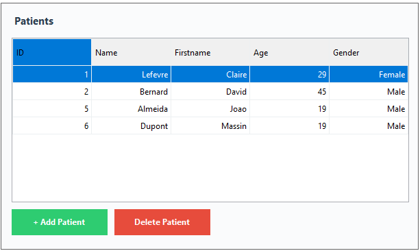

#### Vue d'ensemble
L'onglet Patients fournit une vue complète de tous les dossiers patients du système. Contrairement à l'onglet médicaments, cette grille est en lecture seule par conception, exigeant des formulaires dédiés pour la création et la modification afin d'assurer l'intégrité des données pour les informations sensibles des patients.

#### Implémentation technique

**Configuration du DataGridView :**
- **Colonnes affichées** :
  - `ID` : Identifiant unique du patient (clé primaire)
  - `Nom` : Nom de famille du patient
  - `Prénom` : Prénom du patient
  - `Âge` : Âge du patient en années (optionnel)
  - `Genre` : Affiché comme « Homme » ou « Femme » (stocké en booléen dans la base)

- **Propriétés de la grille** :
  - `ReadOnly = true` : Aucune édition en ligne autorisée pour les données patient
  - `AllowUserToAddRows = false` : Création uniquement via le bouton « + Ajouter un patient »
  - `AllowUserToDeleteRows = false` : Suppression contrôlée via le bouton « Supprimer le patient »
  - `SelectionMode = FullRowSelect` : Sélection complète de ligne pour la création d'ordonnance

**Fonctionnalités clés :**

**1. Voir tous les patients**
- Affiche tous les patients du système, tous médecins confondus
- Données chargées via `PatientDAO.GetAll()`, qui effectue une JOIN avec la table User :
  ```sql
  SELECT pa.*, u.id_user, u.name AS user_name, u.firstname AS user_firstname,
         u.role AS user_role, u.email AS user_email
  FROM Patient pa
  JOIN User u ON pa.id_user = u.id_user;
  ```
- Indique quel médecin a créé chaque dossier patient (bien que non affiché dans cette vue)

**2. Formatage de l'affichage du genre**
- La base stocke le genre en booléen : `false = Femme`, `true = Homme`
- Un formatage de cellule personnalisé convertit le booléen en texte lisible :
  ```csharp
  e.Value = genderValue ? "Homme" : "Femme";
  ```
- Offre une meilleure expérience utilisateur que l'affichage « True/False »

**3. Ajouter un nouveau patient**
- Cliquer sur le bouton vert **« + Ajouter un patient »** ouvre le [Formulaire de création de patient](#-formulaire-de-création-de-patient)
- La boîte de dialogue modale assure le focus sur la création de patient
- Les nouveaux patients sont automatiquement associés au médecin connecté
- La grille se rafraîchit automatiquement après la création

**4. Supprimer un patient**
- Sélectionnez une ligne patient en cliquant n'importe où dessus
- Cliquez sur le bouton rouge **« Supprimer le patient »**
- Une boîte de dialogue de confirmation apparaît : « Êtes-vous sûr de vouloir supprimer ce patient ? »
- En cas de confirmation :
  1. Exécute `PatientDAO.Delete(patientId)` :
     ```sql
     DELETE FROM Patient WHERE id_patient = @id_patient;
     ```
  2. **Suppressions en cascade** : Supprime automatiquement toutes les ordonnances associées et leurs relations avec les médicaments (via `ON DELETE CASCADE`)
  3. Message de succès : « Patient supprimé avec succès »
  4. La grille se rafraîchit pour retirer le patient supprimé

**5. Sélectionner un patient pour une ordonnance**
- Le patient sélectionné est utilisé lors du clic sur « Créer une ordonnance » dans l'onglet Ordonnances
- La sélection persiste lors des changements d'onglet
- Vérifie qu'un patient est sélectionné avant d'autoriser la création d'ordonnance

**Exemple de données affichées :**
| ID | Nom | Prénom | Âge | Genre |
|----|-----|--------|-----|-------|
| 1 | Lefevre | Claire | 29 | Femme |
| 2 | Bernard | David | 45 | Homme |
| 5 | Almeida | Joao | 19 | Homme |
| 6 | Dupont | Massin | 19 | Homme |

**Considérations d'intégrité des données :**

**Pourquoi en lecture seule ?**
- Les données patient sont des informations de santé sensibles nécessitant une validation soignée
- Empêche les modifications accidentelles lors de la consultation
- Garantit que toutes les modifications passent par des flux de validation appropriés
- Maintient une piste d'audit des modifications (nécessiterait un formulaire d'édition dédié)

**Impact des suppressions en cascade :**
- Supprimer un patient supprime TOUTES ses ordonnances
- Toutes les relations médicament-ordonnance (table Appartient) sont également supprimées
- **Avertissement** : C'est permanent et irréversible
- La boîte de dialogue de confirmation aide à éviter les suppressions accidentelles

**Détails techniques :**
- La liaison de données utilise `BindingList<Patient>` pour les mises à jour automatiques de l'UI
- Les objets Patient incluent une propriété de navigation vers User (médecin ayant créé le dossier)
- Le champ Âge est nullable en base (`int?` dans le modèle C#)
- Le champ Genre est nullable mais généralement requis à la création

**Emplacement du code** : [Forms/DoctorForm.cs:245-312](Forms/DoctorForm.cs#L245-L312)

---

### Formulaire de création de patient

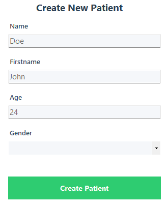

#### Vue d'ensemble
Le formulaire de création de patient est une boîte de dialogue modale spécialisée pour enregistrer de nouveaux patients dans le système. Il collecte les informations démographiques essentielles et associe le patient au médecin actuellement connecté pour un suivi correct des dossiers.

#### Implémentation technique

**Composants du formulaire :**
- **Champ Nom** : Nom de famille du patient (obligatoire, max 100 caractères)
- **Champ Prénom** : Prénom du patient (obligatoire, max 100 caractères)
- **Champ Âge** : Âge du patient en années (optionnel, entier uniquement)
- **Liste déroulante Genre** : ComboBox avec les options « Homme » ou « Femme » (obligatoire)
- **Bouton Créer le patient** : Grand bouton vert pour soumettre le formulaire

**Règles de validation :**

1. **Champs obligatoires** :
   - Nom ne doit pas être vide
   - Prénom ne doit pas être vide
   - Genre doit être sélectionné
   - En cas d'échec de validation : « Veuillez remplir tous les champs obligatoires (Nom, Prénom et Genre) »

2. **Validation de l'âge** :
   - L'âge est optionnel (peut être laissé vide)
   - Si renseigné, doit être un entier valide
   - Si invalide : « Veuillez saisir un âge valide »

3. **Validation du genre** :
   - Doit sélectionner « Homme » ou « Femme » dans la liste déroulante
   - Ne peut pas être laissé vide
   - La liste déroulante empêche les saisies invalides

**Processus de création :**

1. **Saisie utilisateur** : Le médecin remplit les informations du patient

2. **Conversion du genre** : Le texte de la liste déroulante est converti en booléen :
   ```csharp
   bool gender = (genderInput == "Homme");  // true = Homme, false = Femme
   ```

3. **Création de l'objet Patient** :
   ```csharp
   Patient newPatient = new Patient
   {
       Name = name,
       Firstname = firstname,
       Age = age, 
       Gender = gender,  // true/false
       id_user = currentUserId  // Associe avec le médecin
   };
   ```

4. **Insertion en base** : `PatientDAO.Create()` exécute :
   ```sql
   INSERT INTO Patient (name, firstname, age, gender, id_user)
   VALUES (@name, @firstname, @age, @gender, @id_user);
   ```

5. **Flux de succès** :
   - Message de succès : « Patient créé avec succès ! »
   - `DialogResult.OK` retourné au formulaire appelant
   - Le formulaire se ferme automatiquement
   - Le formulaire parent rafraîchit la grille des patients

**Exemple de saisie** (comme dans la capture d'écran) :
- **Nom** : Doe
- **Prénom** : John
- **Âge** : 24
- **Genre** : (Liste déroulante - nécessite la sélection de Homme ou Femme)

**Configuration de la liste déroulante Genre :**
- **Éléments** : ["Homme", "Femme"]
- **Style** : `DropDownList` (l'utilisateur ne peut pas saisir de valeurs personnalisées)
- **Par défaut** : Aucune sélection (vide initialement)
- **Liaison** : Valeurs string converties en booléen pour le stockage en base

**Comportement du formulaire :**

**Pattern de boîte de dialogue modale** :
- Bloque l'interaction avec DoctorForm jusqu'à fermeture
- Le verrouillage du focus assure la finalisation de la saisie
- Le bouton X ferme sans création (DialogResult.Cancel)

**Propriété des données** :
- Chaque patient « appartient » au médecin qui l'a créé via la clé étrangère `id_user`
- Établit la relation médecin-patient dans la base de données
- Utilisé pour les pistes d'audit et l'attribution des données

**Gestion des erreurs :**

1. **Erreurs de validation** :
   - Champs obligatoires vides → Messages d'erreur spécifiques au champ
   - Âge invalide → « Veuillez saisir un âge valide »
   - Genre manquant → « Veuillez remplir tous les champs obligatoires »

2. **Erreurs de base de données** :
   - Échec de connexion → « Erreur lors de la création du patient : [détails] »
   - Violation de clé étrangère → « Erreur : ID utilisateur invalide »

**Impact sur la base de données :**
- Nouvel enregistrement avec clé primaire `id_patient` auto-incrémentée
- La clé étrangère `id_user` crée un lien avec la table User
- Âge stocké en entier
- Genre stocké en booléen (0 = Femme, 1 = Homme)
- L'enregistrement est immédiatement disponible pour la création d'ordonnances

**Améliorations de l'expérience utilisateur :**

1. **Ordre de tabulation** : Flux naturel de Nom → Prénom → Âge → Genre → bouton Créer
2. **Prise en charge de la touche Entrée** : Appuyer sur Entrée passe au champ suivant
3. **Étiquettes claires** : Chaque champ est clairement libellé sans ambiguïté
4. **Liste déroulante** : Empêche les saisies de genre invalides via une sélection contrôlée
5. **Fermeture automatique** : Le formulaire ne reste pas ouvert après création

**Emplacement du code** : [Forms/PatientCreatorForm.cs:18-74](Forms/PatientCreatorForm.cs#L18-L74)

---

### Gestion des ordonnances

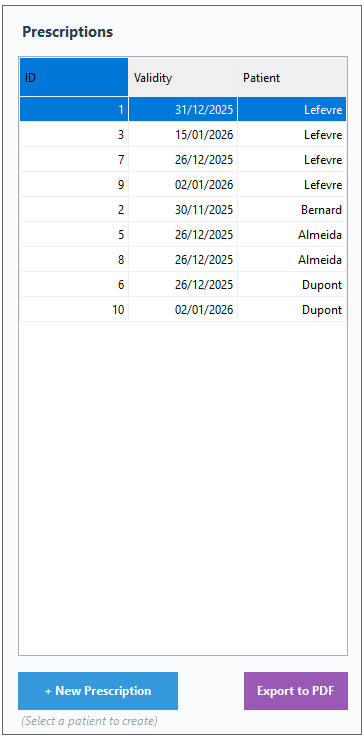

#### Vue d'ensemble
L'onglet Ordonnances sert de point central pour consulter toutes les ordonnances du système, créer de nouvelles ordonnances pour les patients et exporter les ordonnances vers des documents PDF professionnels. Cette interface intègre les données patients, les enregistrements d'ordonnances et les capacités de génération de documents.

#### Implémentation technique

**Configuration du DataGridView :**
- **Colonnes affichées** :
  - `ID` : Identifiant unique de l'ordonnance (clé primaire)
  - `Validité` : Date d'expiration de l'ordonnance (format : JJ/MM/AAAA)
  - `Patient` : Nom de famille du patient (relation par clé étrangère)

- **Propriétés de la grille** :
  - `ReadOnly = true` : Les ordonnances ne peuvent pas être modifiées une fois créées (conception intentionnelle)
  - `SelectionMode = FullRowSelect` : Permet la sélection pour l'export PDF
  - Colonnes auto-dimensionnées selon le contenu

**Fonctionnalités clés :**

**1. Voir toutes les ordonnances**
- Affiche la liste complète de toutes les ordonnances pour tous les patients
- Données chargées via `PrescriptionDAO.GetAll()`, qui effectue des JOINs complexes :
  ```sql
  SELECT pr.*,
         pa.id_patient, pa.name AS patient_name, pa.firstname AS patient_firstname,
         pa.age AS patient_age, pa.gender AS patient_gender,
         u.id_user, u.name AS user_name, u.firstname AS user_firstname,
         u.role AS user_role, u.email AS user_email
  FROM Prescription pr
  JOIN Patient pa ON pr.id_patient = pa.id_patient
  JOIN User u ON pr.id_user = u.id_user;
  ```
- Affiche l'ID de l'ordonnance, la date de validité et le patient associé

**2. Formatage de l'affichage Patient**
- La colonne Patient affiche uniquement le nom de famille pour un affichage compact
- Les détails complets du patient sont disponibles dans l'objet ordonnance
- Un formatage de cellule personnalisé extrait le nom du patient depuis l'objet Patient :
  ```csharp
  if (e.Value is Patient patient)
  {
      e.Value = patient.Name;
      e.FormattingApplied = true;
  }
  ```

**3. Créer une nouvelle ordonnance**
- Le bouton bleu **« + Nouvelle ordonnance »** lance la création d'ordonnance
- **Prérequis** : Un patient doit d'abord être sélectionné dans l'onglet Patients
- Vérification : « Veuillez d'abord sélectionner un patient dans l'onglet Patients »
- Ouvre le [Formulaire de création d'ordonnance](#-formulaire-de-création-dordonnance) pour le patient sélectionné

**4. Export en PDF**
- Le bouton violet **« Exporter en PDF »** génère un document d'ordonnance professionnel
- **Prérequis** : Une ordonnance doit être sélectionnée dans la grille
- Ouvre `SaveFileDialog` pour que l'utilisateur choisisse l'emplacement d'export
- Nom de fichier par défaut : `Prescription_[NomPatient].pdf`

**Exemple de données affichées :**
| ID | Validité | Patient |
|----|----------|---------|
| 1 | 31/12/2025 | Lefevre |
| 3 | 15/01/2026 | Lefevre |
| 7 | 26/12/2025 | Lefevre |
| 9 | 02/01/2026 | Lefevre |
| 2 | 30/11/2025 | Bernard |
| 5 | 26/12/2025 | Almeida |
| 8 | 26/12/2025 | Almeida |
| 6 | 26/12/2025 | Dupont |
| 10 | 02/01/2026 | Dupont |

**Processus de création d'ordonnance :**

1. **Sélection du patient** : Le médecin sélectionne un patient dans l'onglet Patients
2. **Cliquer sur Créer** : Bouton « + Nouvelle ordonnance »
3. **Ouverture du formulaire** : PrescriptionForm s'affiche avec le nom du patient en titre
4. **Ajout des médicaments** : Le médecin sélectionne médicaments et quantités
5. **Soumettre** : Bouton « Créer l'ordonnance »
6. **Opérations en base** :
   - Création de l'enregistrement Prescription avec date de validité auto-générée (30 jours à partir de la création)
   - Insertion dans la table Prescription (retourne le nouvel ID)
   - Pour chaque médicament sélectionné, insertion dans la table Appartient
7. **Rafraîchissement de la grille** : La nouvelle ordonnance apparaît dans la grille

**Processus d'export PDF :**

1. **Sélection de l'ordonnance** : Le médecin clique sur une ligne ordonnance dans la grille
2. **Cliquer sur Exporter** : Bouton « Exporter en PDF »
3. **Récupération des données** :
   - Récupération des détails complets de l'ordonnance via `PrescriptionDAO.Get(id)`
   - Récupération de tous les médicaments de l'ordonnance via `AppartientDAO.GetMedicinesForPrescription(id)`
4. **Boîte de dialogue Fichier** : SaveFileDialog demande l'emplacement de sauvegarde
5. **Génération du PDF** : Voir [Détails de l'export PDF](#-export-pdf-de-lordonnance) ci-dessous
6. **Ouverture automatique** : Le PDF s'ouvre automatiquement dans la visionneuse par défaut
7. **Message de succès** : « PDF exporté avec succès ! »

**Export PDF de l'ordonnance**

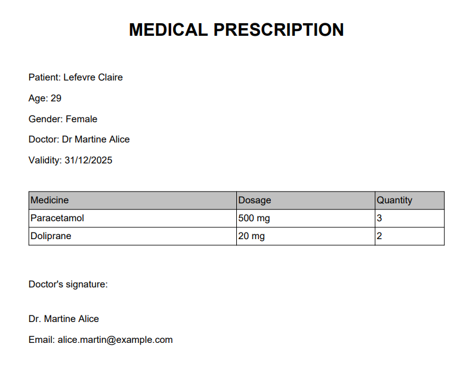

#### Structure du document PDF

Le PDF exporté est un document d'ordonnance médicale formaté professionnellement, généré à l'aide de la bibliothèque iText7.

**Composants du document :**

**1. En-tête**
- **Titre** : « ORDONNANCE MÉDICALE » (grand, gras, centré)
- Apparence professionnelle avec identification claire du document

**2. Bloc d'informations patient**
- **Patient** : Nom complet (Prénom + Nom)
- **Âge** : Âge du patient en années
- **Genre** : « Homme » ou « Femme » (converti depuis le booléen)
- Formaté clairement pour une identification rapide du patient

**3. Informations du médecin**
- **Médecin** : Titre (« Dr ») + Nom complet du médecin
- Identifie le médecin prescripteur

**4. Métadonnées de l'ordonnance**
- **Validité** : Date d'expiration de l'ordonnance (généralement 30 jours à compter de l'émission)
- Format : JJ/MM/AAAA

**5. Tableau des médicaments**
- **Colonnes** : Médicament | Dosage | Quantité
- **Données** : Tous les médicaments inclus dans l'ordonnance avec :
  - Nom commercial du médicament
  - Force du dosage (ex. : « 500 mg », « 20 mg »)
  - Quantité prescrite (nombre d'unités)
- Mise en forme professionnelle du tableau avec bordures et colonnes alignées

**6. Bloc de signature du médecin**
- **Étiquette** : « Signature du médecin : »
- **Nom du médecin** : Répété pour vérification
- **Email** : Email de contact du médecin
- Espace pour la signature physique

**Exemple de contenu PDF** (d'après la capture d'écran) :

```
ORDONNANCE MÉDICALE

Patient : Lefevre Claire
Âge : 29
Genre : Femme
Médecin : Dr Martine Alice
Validité : 31/12/2025

┌─────────────┬─────────┬──────────┐
│ Médicament  │ Dosage  │ Quantité │
├─────────────┼─────────┼──────────┤
│ Paracetamol │ 500 mg  │ 3        │
│ Doliprane   │ 20 mg   │ 2        │
└─────────────┴─────────┴──────────┘

Signature du médecin :

Dr. Martine Alice
Email : alice.martin@example.com
```

**Implémentation technique :**

**Code de génération PDF avec iText7 :**
```csharp
// Création du document
PdfWriter writer = new PdfWriter(filePath);
PdfDocument pdf = new PdfDocument(writer);
Document document = new Document(pdf);

// Ajout du titre
Paragraph title = new Paragraph("ORDONNANCE MÉDICALE")
    .SetTextAlignment(TextAlignment.CENTER)
    .SetFontSize(20)
    .SetBold();
document.Add(title);

// Ajout des informations patient
document.Add(new Paragraph($"Patient : {patient.Firstname} {patient.Name}"));
document.Add(new Paragraph($"Âge : {patient.Age}"));
document.Add(new Paragraph($"Genre : {(patient.Gender ? "Homme" : "Femme")}"));

// Ajout des informations médecin
document.Add(new Paragraph($"Médecin : Dr {doctor.Firstname} {doctor.Name}"));

// Ajout de la validité
document.Add(new Paragraph($"Validité : {prescription.Validity:dd/MM/yyyy}"));

// Création du tableau des médicaments
Table table = new Table(3);
table.AddHeaderCell("Médicament");
table.AddHeaderCell("Dosage");
table.AddHeaderCell("Quantité");

foreach (var appartient in medicines)
{
    table.AddCell(appartient.Medicine.Name);
    table.AddCell(appartient.Medicine.Dosage);
    table.AddCell(appartient.Quantity.ToString());
}
document.Add(table);

// Ajout du bloc de signature
document.Add(new Paragraph("Signature du médecin :"));
document.Add(new Paragraph($"Dr. {doctor.Firstname} {doctor.Name}"));
document.Add(new Paragraph($"Email : {doctor.Email}"));

document.Close();
```

**Propriétés du PDF :**
- **Format de page** : A4 (standard international)
- **Marges** : Marges par défaut (environ 36pt sur tous les côtés)
- **Police** : Helvetica (par défaut système)
- **Encodage** : UTF-8 (prise en charge des caractères internationaux)
- **Taille du fichier** : Généralement 5-15 Ko selon le contenu

**Cas d'utilisation :**
- Le patient reçoit une ordonnance imprimée pour la pharmacie
- Archivage des dossiers médicaux électroniques
- Documentation pour les demandes de remboursement d'assurance
- Vérification de la délivrance en pharmacie
- Pistes d'audit médical

**Gestion des erreurs :**
- Aucune ordonnance sélectionnée : « Veuillez sélectionner une ordonnance à exporter »
- Accès au fichier refusé : « Erreur lors de l'accès au fichier : [détails] »
- Erreur de récupération en base : « Erreur lors de la récupération des données de l'ordonnance : [détails] »
- Erreur de génération PDF : Message d'exception détaillé affiché

**Emplacement du code** : [Forms/DoctorForm.cs:314-425](Forms/DoctorForm.cs#L314-L425)

---

### Formulaire de création d'ordonnance

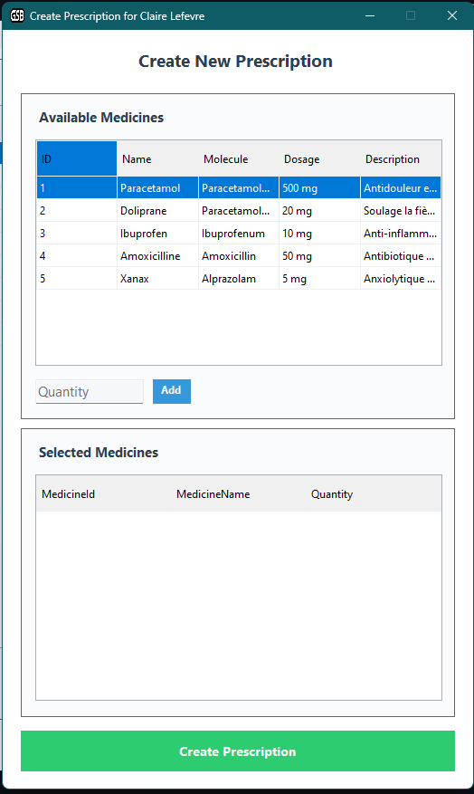
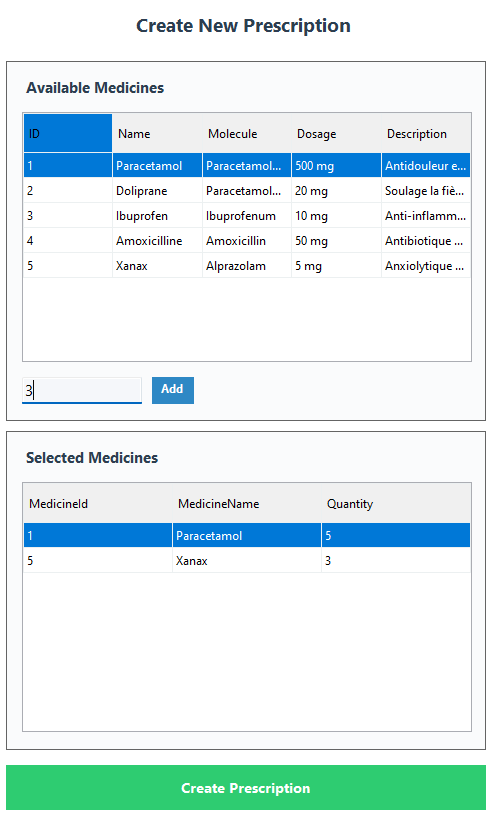

#### Vue d'ensemble
Le formulaire de création d'ordonnance est une interface sophistiquée à double grille qui permet aux médecins de construire des ordonnances multi-médicaments avec un contrôle précis des quantités. Ce formulaire met en œuvre un flux de sélection de médicaments où les médecins parcourent les médicaments disponibles, spécifient les quantités et compilent une ordonnance complète avant soumission.

#### Implémentation technique

**Disposition du formulaire :**

**Section supérieure : Grille des médicaments disponibles**
- **Objectif** : Parcourir et sélectionner les médicaments à ajouter à l'ordonnance
- **Colonnes** :
  - `ID` : Clé primaire du médicament
  - `Nom` : Nom commercial
  - `Molécule` : Principe actif pharmaceutique
  - `Dosage` : Force/concentration
  - `Description` : Informations thérapeutiques
- **Propriétés** :
  - `ReadOnly = true` : Aucune édition autorisée
  - `SelectionMode = FullRowSelect` : Cliquez n'importe où sur la ligne pour sélectionner

**Section centrale : Contrôles d'ajout de médicament**
- **Champ Quantité** : Champ texte numérique pour spécifier le nombre d'unités
- **Bouton Ajouter** : Bouton bleu pour ajouter le médicament sélectionné à l'ordonnance

**Section inférieure : Grille des médicaments sélectionnés**
- **Objectif** : Afficher les médicaments qui seront inclus dans l'ordonnance
- **Colonnes** :
  - `MedicineId` : Masqué (utilisé pour les opérations en base)
  - `MedicineName` : Nom d'affichage du médicament sélectionné
  - `Quantity` : Nombre d'unités prescrites
- **Propriétés** :
  - `ReadOnly = true` : Consultation uniquement (supprimer en sélectionnant à nouveau et en ajoutant avec une quantité de 0)

**Bouton inférieur : Créer l'ordonnance**
- **Grand bouton vert** : Soumet l'ordonnance à la base de données

**Barre de titre du formulaire :**
- Dynamique : « Créer une ordonnance pour [Nom du Patient] »
- Fournit le contexte sur le patient concerné par l'ordonnance

**Processus de sélection des médicaments :**

**Étape 1 : Sélectionner un médicament dans la liste des disponibles**
1. Le médecin clique sur une ligne médicament dans la grille supérieure
2. Les détails du médicament sont récupérés depuis la ligne sélectionnée
3. La sélection est mise en évidence en bleu

**Étape 2 : Saisir la quantité**
1. Le médecin saisit la quantité dans la zone de texte « Quantité »
2. Doit être un entier positif
3. Aucune validation jusqu'au clic sur le bouton « Ajouter »

**Étape 3 : Cliquer sur le bouton Ajouter**
1. Le système valide :
   - Un médicament est sélectionné dans la grille supérieure
   - Le champ quantité n'est pas vide
   - La quantité est un entier positif valide

2. **Vérification de doublon** : Le système vérifie si le médicament est déjà dans la grille des médicaments sélectionnés
   - Si OUI : Met à jour la quantité avec la nouvelle valeur (écrase la précédente)
   - Si NON : Ajoute une nouvelle ligne à la grille des médicaments sélectionnés

3. **Classe d'aide** : Utilise la classe `MedicineSelection` pour la liaison de données :
   ```csharp
   public class MedicineSelection
   {
       public int MedicineId { get; set; }
       public string MedicineName { get; set; }
       public int Quantity { get; set; }
   }
   ```

4. Médicaments sélectionnés stockés dans une liste privée : `List<MedicineSelection> _selectedMedicines`

**Étape 4 : Vérifier les médicaments sélectionnés**
- Le médecin peut voir tous les médicaments ajoutés dans la grille inférieure
- Peut vérifier les médicaments et quantités avant soumission

**Étape 5 : Créer l'ordonnance**
1. Le médecin clique sur le bouton vert « Créer l'ordonnance »

2. **Validation finale** :
   - Au moins un médicament doit être sélectionné
   - Si aucun médicament : « Veuillez ajouter au moins un médicament à l'ordonnance »

3. **Calcul de la date de validité** :
   ```csharp
   DateTime validity = DateTime.Now.AddMonths(1);  // 30 jours à partir d'aujourd'hui
   ```

4. **Création de l'objet Prescription** :
   ```csharp
   Prescription newPrescription = new Prescription
   {
       id_patient = selectedPatientId,
       id_user = currentUserId,
       Validity = validity
   };
   ```

5. **Opérations en base** (Processus en deux étapes) :

   **Étape 5a : Création de l'enregistrement Prescription**
   ```sql
   INSERT INTO Prescription (id_patient, id_user, validity)
   VALUES (@id_patient, @id_user, @validity);
   SELECT LAST_INSERT_ID();  -- Retourne le nouvel ID d'ordonnance
   ```

   **Étape 5b : Ajout des médicaments à l'ordonnance**
   Pour chaque médicament dans la liste `_selectedMedicines` :
   ```sql
   INSERT INTO Appartient (id_prescription, id_medicine, quantity)
   VALUES (@id_prescription, @id_medicine, @quantity);
   ```

6. **Flux de succès** :
   - Message de succès : « Ordonnance créée avec succès ! »
   - Le formulaire se ferme automatiquement
   - Le formulaire parent rafraîchit la grille des ordonnances
   - La nouvelle ordonnance apparaît avec la date de validité actuelle

**Exemple de flux de travail** (d'après les captures d'écran) :

**État vide (createprescription.png)** :
- La grille des médicaments disponibles affiche tous les médicaments (Paracetamol, Doliprane, Ibuprofen, Amoxicilline, Xanax)
- Champ Quantité vide
- Grille des médicaments sélectionnés vide
- Titre : « Créer une ordonnance pour Claire Lefevre »

**État rempli (filledcreateprescription.png)** :
- La saisie Quantité affiche « 3 »
- La grille des médicaments sélectionnés contient :
  - ID : 1, Médicament : Paracetamol, Quantité : 5
  - ID : 5, Médicament : Xanax, Quantité : 3
- Prêt à la soumission via le bouton « Créer l'ordonnance »

**Détails techniques :**

**Chargement des données :**
- Médicaments disponibles chargés via `MedicineDAO.GetAll()` à l'ouverture du formulaire
- Garantit que tous les médicaments en base sont disponibles à la sélection
- Pas de filtrage par médecin (tous les médicaments partagés au niveau du système)

**Gestion des quantités :**
- Pas de quantités décimales (entier uniquement)
- Le champ quantité est effacé après chaque clic sur « Ajouter » pour une saisie rapide

**Prévention des doublons :**
- Un médicament ne peut apparaître qu'une seule fois dans la grille des médicaments sélectionnés
- Ajouter à nouveau le même médicament met à jour la quantité (remplace la valeur précédente)
- Implémentation :
  ```csharp
  var existing = _selectedMedicines.FirstOrDefault(m => m.MedicineId == selectedMedicineId);
  if (existing != null)
      existing.Quantity = newQuantity;  // Mise à jour
  else
      _selectedMedicines.Add(newMedicine);  // Ajout
  ```

**Considérations transactionnelles :**
- La création de l'ordonnance et l'ajout des médicaments sont des opérations SQL distinctes
- Pas encapsulées dans une transaction explicite (point d'amélioration potentiel)
- Si l'ajout des médicaments échoue, l'enregistrement d'ordonnance existe déjà (enregistrement orphelin possible)
- La suppression en cascade nettoierait si l'ordonnance était supprimée

**Gestion des erreurs :**

1. **Erreurs de validation** :
   - Aucun médicament sélectionné : « Veuillez sélectionner un médicament »
   - Quantité vide : « Veuillez saisir une quantité »
   - Quantité invalide : « La quantité doit être un nombre positif »
   - Aucun médicament ajouté : « Veuillez ajouter au moins un médicament à l'ordonnance »

2. **Erreurs de base de données** :
   - Échec de création de l'ordonnance : « Erreur lors de la création de l'ordonnance : [détails] »
   - Échec d'ajout de médicament : « Erreur lors de l'ajout du médicament à l'ordonnance : [détails] »
   - Violations de clé étrangère : Évitées par la logique UI (IDs patient et utilisateur validés avant ouverture du formulaire)

**Fonctionnalités d'expérience utilisateur :**

1. **Contexte visuel** : Le nom du patient en barre de titre tient le médecin informé
2. **Conception à deux grilles** : Sépare la consultation de la sélection
3. **Quantité en ligne** : Ajout de quantité sans ouvrir un autre formulaire
4. **Saisie rapide** : Permet d'ajouter plusieurs médicaments rapidement
5. **Vérification avant soumission** : La grille inférieure offre une opportunité de vérification
6. **Fermeture automatique** : Le formulaire se ferme après une création réussie (pas besoin de fermeture manuelle)

**Emplacement du code** : [Forms/PrescriptionForm.cs:19-156](Forms/PrescriptionForm.cs#L19-L156)

---

## 3. Interface Administrateur

L'interface Administrateur fournit des capacités complètes de gestion des utilisateurs, accessibles uniquement aux utilisateurs disposant des privilèges administrateur (Role = true).

---

### Gestion des utilisateurs administrateur

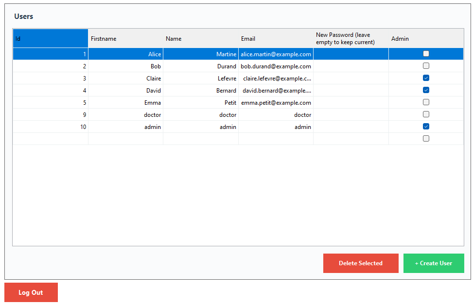

#### Vue d'ensemble
La page administrateur est une interface de gestion des utilisateurs qui permet aux administrateurs de consulter, créer, modifier et supprimer les utilisateurs du système (médecins et administrateurs). Cette interface dispose de capacités avancées d'édition en ligne avec synchronisation en temps réel avec la base de données.

#### Implémentation technique

**Configuration du DataGridView :**
- **Colonnes affichées** :
  - `Id` : Clé primaire de l'utilisateur (lecture seule pour les utilisateurs existants)
  - `Prénom` : Prénom de l'utilisateur (modifiable)
  - `Nom` : Nom de famille de l'utilisateur (modifiable)
  - `Email` : Adresse email de l'utilisateur (modifiable, doit être unique)
  - `Nouveau mot de passe (laisser vide pour conserver l'actuel)` : Champ optionnel de réinitialisation du mot de passe
  - `Admin` : Case à cocher pour l'attribution du rôle (true = Admin, false = Médecin)

- **Propriétés de la grille** :
  - `AllowUserToAddRows = true` : Une nouvelle ligne apparaît en bas pour la création d'utilisateur
  - `AllowUserToDeleteRows = true` : Permet de sélectionner et supprimer des lignes (nécessite confirmation)
  - `ReadOnly = false` : Édition en ligne activée
  - `EditMode = EditOnEnter` : Clic unique pour éditer les cellules

**Fonctionnalités clés :**

**1. Voir tous les utilisateurs**
- Affiche la liste complète des utilisateurs du système (médecins et administrateurs)
- Données chargées via `UserDAO.GetAll()` :
  ```sql
  SELECT * FROM User;
  ```
- Affiche les détails et le statut de rôle de l'utilisateur
- L'administrateur actuellement connecté est visible dans la liste

**2. Édition en ligne des utilisateurs**
- Cliquez sur n'importe quelle cellule pour éditer directement dans la grille
- Les modifications s'appliquent immédiatement quand vous passez à une autre cellule
- L'événement `CellValueChanged` se déclenche à la sortie de cellule

**Flux d'édition :**
```csharp
private void UsersDataGridView_CellValueChanged(object sender, DataGridViewCellEventArgs e)
{
    var userDisplay = userDisplayList[e.RowIndex];

    if (userDisplay.Id == 0)
        CreateNewUser(userDisplay);  // Nouvel utilisateur (ligne vide)
    else
        UpdateExistingUser(userDisplay, e.ColumnIndex);  // Utilisateur existant
}
```

**3. Mettre à jour les utilisateurs existants**
- Modifier le nom, prénom, email ou statut admin
- Le champ mot de passe peut être utilisé pour réinitialiser les mots de passe utilisateur

**Logique de mise à jour :**

**Modifications Nom/Email/Rôle :**
```sql
UPDATE User
SET firstname = @firstname,
    name = @name,
    email = @email,
    role = @role
WHERE id_user = @id;
```

**Réinitialisation du mot de passe (si le champ Nouveau mot de passe a du contenu) :**
```sql
UPDATE User
SET password = SHA2(@password, 256)
WHERE id_user = @id;
```

- Mot de passe haché en SHA-256 avant stockage
- L'utilisateur doit se reconnecter avec le nouveau mot de passe
- Le champ mot de passe est effacé après mise à jour

**4. Créer un nouvel utilisateur**
- Faites défiler en bas de la grille et éditez la ligne vide
- Remplissez : Prénom, Nom, Email, Mot de passe (obligatoire)
- Cochez la case « Admin » si des privilèges admin sont nécessaires
- Appuyez sur Entrée ou cliquez ailleurs pour déclencher la création

**Processus de création :**

1. **Détection** : Le système détecte `Id == 0` (indicateur de nouvel utilisateur)

2. **Validation** :
   - Tous les champs (sauf Nouveau mot de passe après création) doivent être remplis
   - L'email doit être unique en base
   - En cas d'échec de validation : « Veuillez remplir tous les champs »

3. **Insertion en base** :
   ```sql
   INSERT INTO User (firstname, name, email, password, role)
   VALUES (@firstname, @name, @email, SHA2(@password, 256), @role);
   ```

4. **Post-création** :
   - Message de succès : « Utilisateur créé avec succès ! »
   - La grille se rafraîchit avec le nouvel ID utilisateur attribué
   - Le champ mot de passe est effacé pour la sécurité

**5. Supprimer un utilisateur**
- Sélectionnez une ligne utilisateur en cliquant sur l'en-tête de ligne (colonne numérotée à gauche)
- Cliquez sur le bouton rouge « Supprimer la sélection »
- Boîte de dialogue de confirmation : « Êtes-vous sûr de vouloir supprimer cet utilisateur ? »

**Impact de la suppression :**
- Exécute `UserDAO.Delete(userId)` :
  ```sql
  DELETE FROM User WHERE id_user = @id_user;
  ```
- **Suppressions en cascade** de TOUTES les données associées :
  - Tous les patients créés par l'utilisateur
  - Tous les médicaments créés par l'utilisateur
  - Toutes les ordonnances créées par l'utilisateur
  - Toutes les relations médicament-ordonnance (Appartient)
- **Opération irréversible** : Pas de soft delete ni de mécanisme de récupération
- Message de succès : « Utilisateur supprimé avec succès ! »

**6. Créer un utilisateur via le bouton**
- Cliquez sur le bouton vert « + Créer un utilisateur »
- Ouvre la boîte de dialogue modale [Formulaire de création d'utilisateur](#-formulaire-de-création-dutilisateur)
- Alternative à la création en ligne
- Même résultat que l'édition d'une ligne vide dans la grille

**7. Déconnexion**
- Bouton rouge « Déconnexion » dans le coin inférieur gauche
- Ferme AdminForm et retourne à l'écran de connexion (MainForm)
- Pas de persistance de session (doit se reconnecter)

**Exemple de données affichées :**
| Id | Prénom | Nom | Email | Nouveau mot de passe | Admin |
|----|--------|-----|-------|----------------------|-------|
| 1 | Alice | Martine | alice.martin@example.com | | ☑ |
| 2 | Bob | Durand | bob.durand@example.com | | ☐ |
| 3 | Claire | Lefevre | claire.lefevre@example.com | | ☑ |
| 4 | David | Bernard | david.bernard@example... | | ☑ |
| 5 | Emma | Petit | emma.petit@example.com | | ☐ |
| 9 | doctor | doctor | doctor | | ☐ |
| 10 | admin | admin | admin | | ☑ |

**Liaison de données :**
```csharp
BindingList<UserDisplay> userDisplayList = new BindingList<UserDisplay>();
usersDataGridView.DataSource = userDisplayList;
```

**Mises à jour en temps réel :**
- L'événement `CellValueChanged` se déclenche immédiatement à la sortie de cellule
- Mises à jour en base en temps réel (pas besoin de bouton « Enregistrer »)
- La grille se rafraîchit pour afficher les données mises à jour
- Mises à jour optimistes de l'UI (suppose le succès)

**Configuration des colonnes :**
```csharp
// Masquer les propriétés de navigation
usersDataGridView.Columns["Password"].Visible = false;  // Le hash n'est jamais affiché

// En-tête de colonne mot de passe
usersDataGridView.Columns["NewPassword"].HeaderText = "Nouveau mot de passe (laisser vide pour conserver l'actuel)";

// Colonne Admin en case à cocher
usersDataGridView.Columns["Admin"].HeaderText = "Admin";
```

**Considérations de sécurité :**

**Gestion des mots de passe :**
- Le hachage SHA-256 empêche le stockage en clair
- Les administrateurs peuvent réinitialiser le mot de passe de n'importe quel utilisateur
- Aucune notification à l'utilisateur lorsqu'un admin réinitialise son mot de passe

**Gestion des rôles :**
- Les administrateurs peuvent promouvoir des médecins en admins ou rétrograder des admins en médecins
- Aucune piste d'audit des changements de rôle

**Suppression d'utilisateur :**
- Opération extrêmement destructive (cascade vers toutes les données utilisateur)
- Seule la boîte de dialogue de confirmation prévient les suppressions accidentelles

**Unicité de l'email :**
- La base impose une contrainte UNIQUE sur l'email
- Les tentatives de doublon entraînent une erreur : « L'email existe déjà »

**Gestion des erreurs :**

1. **Erreurs de validation** :
   - Champs vides : « Veuillez remplir tous les champs »
   - Format d'email invalide : Non validé (accepte n'importe quelle chaîne)
   - Email dupliqué : « L'email existe déjà dans le système »

2. **Erreurs de base de données** :
   - Échec de connexion : « Erreur lors de l'accès à la base de données : [détails] »
   - Violations de clé étrangère : Évitées par la logique UI
   - Conflits de mise à jour : « Erreur lors de la mise à jour de l'utilisateur : [détails] »

3. **Erreurs de permission** :
   - Seuls les administrateurs peuvent accéder à ce formulaire (imposé par le routage de connexion)

**Fonctionnalités d'expérience utilisateur :**

1. **Édition en ligne** : Pas besoin d'ouvrir des formulaires d'édition séparés
2. **Retour visuel** : Messages de succès après chaque opération
3. **Affichage en case à cocher** : Le rôle est affiché en case à cocher (plus clair que true/false)
4. **Indication mot de passe** : L'en-tête de colonne explique le comportement du champ mot de passe
5. **Doubles méthodes de création** : Création en ligne et par bouton disponibles
6. **Boîtes de dialogue de confirmation** : Préviennent les suppressions accidentelles
7. **Rafraîchissement automatique** : La grille se met à jour immédiatement après les opérations

**Emplacement du code** : [Forms/AdminForm.cs:15-234](Forms/AdminForm.cs#L15-L234)

---

### Formulaire de création d'utilisateur

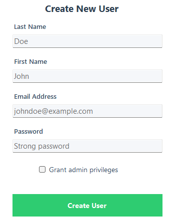

#### Vue d'ensemble
Le formulaire de création d'utilisateur est une boîte de dialogue modale dédiée à la création de nouveaux utilisateurs du système. Ce formulaire fournit une interface claire et focalisée pour permettre aux administrateurs d'ajouter des médecins ou d'autres administrateurs au système avec une attribution de rôle et une configuration d'identifiants appropriées.

#### Implémentation technique

**Composants du formulaire :**
- **Champ Nom** : Nom de famille de l'utilisateur (obligatoire, max 100 caractères)
- **Champ Prénom** : Prénom de l'utilisateur (obligatoire, max 100 caractères)
- **Champ Email** : Email unique de l'utilisateur (obligatoire, max 150 caractères)
- **Champ Mot de passe** : Mot de passe initial du compte utilisateur (obligatoire, max 255 caractères)
- **Accorder les privilèges administrateur** : Case à cocher pour attribuer le rôle admin (par défaut : décochée = Médecin)
- **Bouton Créer l'utilisateur** : Grand bouton vert pour soumettre le formulaire

**Règles de validation :**

1. **Champs obligatoires** :
   - Le Nom ne doit pas être vide
   - Le Prénom ne doit pas être vide
   - L'Email ne doit pas être vide
   - Le Mot de passe ne doit pas être vide
   - En cas d'échec de validation : « Tous les champs sont obligatoires »

2. **Unicité de l'email** :
   - L'email doit être unique en base (contrainte UNIQUE)
   - Si doublon : « L'email existe déjà dans le système »
   - Pas de validation de format (accepte n'importe quelle chaîne)

3. **Exigences pour le mot de passe** :
   - Aucune exigence de complexité imposée
   - Aucune longueur minimale requise
   - Accepte n'importe quelle chaîne non vide
   - Amélioration possible : Ajouter une validation de la robustesse du mot de passe

4. **Attribution du rôle** :
   - Case décochée (par défaut) = Médecin (Role = false)
   - Case cochée = Administrateur (Role = true)

**Processus de création :**

1. **Ouverture du formulaire** : Déclenchée par le bouton « + Créer un utilisateur » dans AdminForm

2. **Saisie utilisateur** : L'administrateur remplit tous les champs obligatoires
   - Saisit nom, prénom, email et mot de passe
   - Coche « Accorder les privilèges administrateur » si le rôle admin est nécessaire

3. **Création de l'objet User** :
   ```csharp
   User newUser = new User
   {
       Name = lastName,
       Firstname = firstName,
       Email = email,
       Password = password,  // Sera haché dans le DAO
       Role = isAdmin       // true = Admin, false = Médecin
   };
   ```

4. **Insertion en base** : `UserDAO.Create()` exécute :
   ```sql
   INSERT INTO User (firstname, name, email, password, role)
   VALUES (@firstname, @name, @email, SHA2(@password, 256), @role);
   ```

5. **Hachage du mot de passe** : Hachage SHA-256 effectué au niveau de la base :
   - Entrée : Mot de passe en clair (ex. : « Strong password »)
   - Sortie : Hash hexadécimal de 64 caractères
   - Exemple : `5e884898da28047151d0e56f8dc6292773603d0d6aabbdd62a11ef721d1542d8`

6. **Flux de succès** :
   - Message de succès : « Utilisateur créé avec succès ! »
   - `DialogResult.OK` retourné à AdminForm
   - Le formulaire se ferme automatiquement
   - AdminForm rafraîchit la grille des utilisateurs
   - Le nouvel utilisateur apparaît dans la liste

**Exemple de saisie** (d'après la capture d'écran) :
- **Nom** : Doe
- **Prénom** : John
- **Email** : johndoe@example.com
- **Mot de passe** : Strong password
- **Accorder les privilèges administrateur** : Décoché (sera Médecin)

**Comportement du formulaire :**

**Pattern de boîte de dialogue modale** :
- Bloque l'interaction avec AdminForm jusqu'à fermeture
- Focus sur la tâche de création d'utilisateur
- Le bouton X ferme sans création (DialogResult.Cancel)
- La touche ÉCHAP annule également la création

**Logique d'attribution du rôle** :
```csharp
bool isAdmin = grantAdminCheckbox.Checked;  // true ou false
```

**Ordre des champs (Navigation par tabulation)** :
1. Nom → Prénom → Email → Mot de passe → Case à cocher → Bouton Créer
2. Flux naturel pour une saisie efficace

**Gestion des erreurs :**

1. **Erreurs de validation** :
   - Champs vides : « Tous les champs sont obligatoires »
   - Affiche une MessageBox avec icône d'erreur
   - Redonne le focus au formulaire pour correction

2. **Erreurs de base de données** :
   - Email dupliqué : « L'email existe déjà dans le système »
   - Échec de connexion : « Erreur lors de la création de l'utilisateur : [détails] »
   - Données invalides : Messages de violation de contraintes de base

3. **Erreurs réseau** :
   - Délai d'attente de connexion à la base
   - Serveur MySQL indisponible
   - Message d'erreur générique avec détails de l'exception

**Considérations de sécurité :**

**Gestion du mot de passe** :
- Mot de passe en clair saisi dans le formulaire
- Transmis au DAO en clair (même processus)
- Haché uniquement au moment de l'insertion en base via la fonction SHA2()
- Mot de passe jamais stocké en clair dans la base
- Amélioration : Hacher côté client avant transmission

**Email comme nom d'utilisateur** :
- L'email sert d'identifiant unique (nom d'utilisateur)
- Pas de champ nom d'utilisateur séparé
- Impose le format email comme identifiant de connexion
- Amélioration : Ajouter une validation du format email

**Attribution des privilèges admin** :
- N'importe quel admin peut créer d'autres admins (pas de concept de super-admin)
- Aucune restriction sur la création d'admin
- La case à cocher rend l'attribution du rôle explicite et visible

**Rôle par défaut** :
- Par défaut au rôle Médecin (case décochée)
- Valeur par défaut plus sûre (principe du moindre privilège)
- Le rôle Admin doit être explicitement sélectionné

**Impact sur la base de données :**

**Nouvel enregistrement utilisateur :**
```
id_user : [Clé primaire auto-incrémentée]
firstname : "John"
name : "Doe"
email : "johndoe@example.com"
password : [hash SHA-256 de "Strong password"]
role : false (Médecin) ou true (Admin)
```

**Effets immédiats :**
- L'utilisateur peut se connecter immédiatement avec les identifiants fournis
- Les utilisateurs Médecin peuvent accéder à DoctorForm
- Les utilisateurs Admin peuvent accéder à AdminForm
- L'utilisateur n'a encore aucun patient, médicament ou ordonnance associés

**Fonctionnalités d'expérience utilisateur :**

1. **Étiquettes claires** : Chaque champ a une étiquette explicite (pas seulement un en-tête de colonne)
2. **Disposition logique** : Disposition de formulaire verticale avec un bon espacement
3. **Hiérarchie visuelle** : Grand bouton vert pour l'action principale
4. **Étiquette de case à cocher** : « Accorder les privilèges administrateur » est plus descriptif que « Admin »
5. **Focus modal** : Une fenêtre dédiée évite la distraction
6. **Fermeture automatique** : Pas de fermeture manuelle nécessaire après succès

**Emplacement du code** : [Forms/UserCreatorForm.cs:16-62](Forms/UserCreatorForm.cs#L16-L62)

---
