# GSB Medical Prescription Management System

<div align="center">

<p align="center">


</p>

**A comprehensive medical prescription management application built for the BTS SIO SLAM final exam**

[Features](#features) • [Installation](#installation) • [User Guide](#complete-user-guide-with-screenshots) • [Architecture](#architecture) • [Database](#database-schema)

</div>

---

## Table of Contents

- [About](#about-the-project)
- [Features](#features)
- [Tech Stack](#tech-stack)
- [Installation](#installation)
- [Complete User Guide](#complete-user-guide-with-screenshots)
  - [Authentication System](#1-authentication-system)
  - [Doctor Interface](#2-doctor-interface)
  - [Admin Interface](#3-admin-interface)
- [Architecture](#architecture)
- [Database Schema](#database-schema)
- [Project Structure](#project-structure)
- [Security](#security)
- [Credits](#credits)

---

## About the Project

The **GSB Medical Prescription Management System** is a Windows Forms application developed as part of the BTS SIO SLAM curriculum. This software enables healthcare facilities to manage patients, medicines, prescriptions, and users through an intuitive desktop interface.

### Key Objectives

- **Role-Based Access Control**: Separate interfaces for Doctors and Administrators
- **Complete CRUD Operations**: Full Create, Read, Update, Delete functionality for all entities
- **PDF Export**: Generate professional medical prescription documents
- **Data Integrity**: MySQL database with cascade operations and referential integrity
- **Security**: SHA-256 password hashing and SQL injection prevention

---

## Features

### For Doctors

- **Patient Management**: Create, view, and delete patient records
- **Medicine Catalog**: Maintain a comprehensive database of medicines with molecules, dosages, and descriptions
- **Prescription Creation**: Build multi-medicine prescriptions with quantities
- **PDF Export**: Generate professional prescription documents
- **Inline Editing**: Quick updates to medicine information directly in the grid
- **Self-Service Password Reset**: Change password securely

### For Administrators

- **User Management**: Create, update, and delete user accounts (doctors and admins)
- **Role Assignment**: Grant admin or doctor privileges
- **Password Management**: Reset passwords for any user
- **Inline User Editing**: Direct grid editing with real-time database updates
- **System Oversight**: Complete control over all system users

---

## Tech Stack

### Frontend
- **Windows Forms (.NET 8.0)**: Modern desktop UI framework
- **C#**: Primary programming language

### Backend
- **ADO.NET**: Direct database access with MySql.Data
- **3-Layer Architecture**: Models, DAO (Data Access Objects), Forms

### Database
- **MySQL 8.1**: Relational database with ACID compliance
- **Docker**: Containerized database deployment
- **phpMyAdmin**: Web-based database administration

### Libraries & Packages
- **iText7** (v9.4.0): Professional PDF generation
- **MySql.Data** (v9.5.0): MySQL .NET connector
- **iText7.bouncy-castle-adapter** (v9.4.0): Cryptographic support for PDFs

---

## Installation

### Prerequisites

- [.NET 8.0 SDK](https://dotnet.microsoft.com/download/dotnet/8.0) or Runtime (Windows)
- [Docker Desktop](https://www.docker.com/products/docker-desktop) (for MySQL database)
- [Visual Studio 2022](https://visualstudio.microsoft.com/) or later (recommended)
- Git (for cloning the repository)

### Step 1: Clone the Repository

```bash
git clone https://github.com/RyukSylux/bts-gsb-winform.git
cd bts-gsb-winform
```

### Step 2: Start the Database

```bash
docker-compose up -d
```

This will start:
- **MySQL Server** on port `3307`
- **phpMyAdmin** on port `8080` ([http://localhost:8080](http://localhost:8080))

### Step 3: Create the Database

1. Access phpMyAdmin at [http://localhost:8080](http://localhost:8080)
2. Login with:
   - **Server**: `db`
   - **Username**: `root`
   - **Password**: `rootpassword`
3. Create a new database named `bts-gsb`
4. Execute the SQL schema from [DATABASE.md](DATABASE.md)

### Step 4: Create First Admin User

Run this SQL query to create your first admin account:

```sql
INSERT INTO User (firstname, name, role, email, password)
VALUES ('Admin', 'User', 1, 'admin@gsb.fr', SHA2('admin123', 256));
```

### Step 5: Build and Run the Application

**Using Visual Studio:**
1. Open `bts-gsb.sln`
2. Press `F5` or click "Start"

**Using Command Line:**
```bash
dotnet build bts-gsb.sln
dotnet run --project bts-gsb.csproj
```

### Default Login Credentials

- **Email**: `admin@gsb.fr`
- **Password**: `admin123`

---

## Complete User Guide with Screenshots

This section provides an in-depth walkthrough of every feature in the application, demonstrating how each interface works and the underlying technical processes.

---

## 1. Authentication System

### Sign In Page

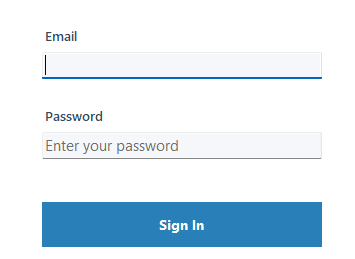

#### Overview
The Sign In page is the entry point of the application, implementing secure authentication with role-based routing. This form validates user credentials against the MySQL database using SHA-256 hashed passwords.

#### Technical Implementation

**Form Components:**
- **Email Input Field**: Accepts the user's email address (unique identifier in the database)
- **Password Input Field**: Masked text field with secure input
- **Sign In Button**: Triggers authentication process
- **Reset Password Link**: Navigates to the password reset interface
- **GitHub Link**: Opens the project repository in the default browser

**Authentication Flow:**

1. **User Input Capture**: When the user enters credentials and clicks "Sign In", the form captures the email and password values

2. **Database Query Execution**: The system executes the following parameterized query via `UserDAO.Login()`:
   ```sql
   SELECT * FROM User
   WHERE email = @email AND password = SHA2(@password, 256);
   ```

3. **Password Hashing**: The password is hashed using SHA-256 at the database level, ensuring the plain text password never exists in the database

4. **Role-Based Routing**: Upon successful authentication, the application checks the user's role:
   - **If Role = true (Admin)**: Redirects to [AdminForm](#3-admin-interface) with full user management capabilities
   - **If Role = false (Doctor)**: Redirects to [DoctorForm](#2-doctor-interface) with patient and prescription management

5. **Error Handling**: If authentication fails, an error message displays: "Invalid email or password"

**Security Features:**
- Parameterized queries prevent SQL injection attacks
- SHA-256 hashing protects passwords (stored hash: 64-character hexadecimal string)
- Failed login attempts display generic error messages (no indication whether email or password was incorrect)
- Password field uses `UseSystemPasswordChar` property for visual masking

**Code Location**: [Forms/MainForm.cs:45-67](Forms/MainForm.cs#L45-L67)

---

### Password Reset Page

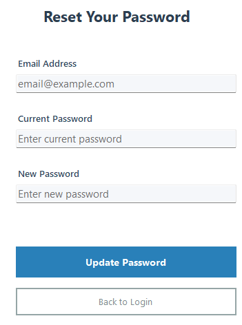

#### Overview
The password reset interface provides users with self-service password management capabilities. This form implements secure password updates requiring verification of the current password before allowing changes.

#### Technical Implementation

**Form Components:**
- **Email Address Field**: User's registered email (unique identifier)
- **Current Password Field**: Verification field to authenticate the password change request
- **New Password Field**: The desired new password
- **Update Password Button**: Triggers the password change process
- **Back to Login Button**: Returns to the main login screen without changes

**Password Update Workflow:**

1. **Input Validation**: The form validates that all three fields are populated before proceeding

2. **Authentication Verification**: The system first verifies the user's identity by checking the email and current password:
   ```sql
   SELECT * FROM User
   WHERE email = @email AND password = SHA2(@oldpassword, 256);
   ```

3. **Password Update Execution**: If verification succeeds, the `UserDAO.UpdatePassword()` method executes:
   ```sql
   UPDATE User
   SET password = SHA2(@newpassword, 256)
   WHERE email = @email AND password = SHA2(@oldpassword, 256);
   ```

4. **Atomic Operation**: The update uses a WHERE clause that includes both email and old password hash, ensuring the password can only be changed if the current credentials are valid

5. **Success Feedback**: Upon successful update:
   - A success message displays: "Password updated successfully"
   - The form automatically closes and returns to the login screen
   - The user must sign in again with the new password

6. **Error Scenarios**:
   - **Incorrect Current Password**: "Current password is incorrect"
   - **Database Connection Error**: "Error updating password: [error details]"
   - **Empty Fields**: "All fields are required"

**Security Considerations:**
- Requires knowledge of the current password (prevents unauthorized password changes if a user leaves their session unlocked)
- New password is immediately hashed with SHA-256 before database storage
- No password complexity requirements enforced (potential improvement area)
- No password confirmation field (accepts any new password input)

**User Experience Features:**
- Clean, minimal interface with clear labeling
- Color-coded buttons (blue for primary action, white for secondary)
- Email field uses placeholder text for guidance
- Enter key support for quick form submission

**Code Location**: [Forms/PasswordForm.cs:23-58](Forms/PasswordForm.cs#L23-L58)

---

## 2. Doctor Interface

The Doctor interface consists of three main tabs accessible via the `DoctorForm`: Medicines, Patients, and Prescriptions. This tabbed interface provides comprehensive management of the doctor's workflow.

---

### Medicines Management

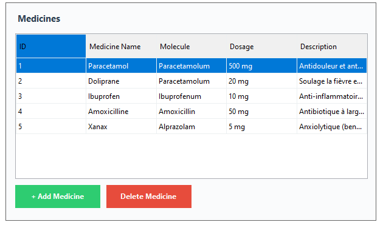

#### Overview
The Medicines tab provides a complete catalog management system for pharmaceutical products. Doctors can view, create, edit, and delete medicine entries with detailed information including active molecules, dosages, and descriptions.

#### Technical Implementation

**DataGridView Configuration:**
- **Columns Displayed**:
  - `ID`: Auto-increment primary key (read-only, displayed for reference)
  - `Medicine Name`: Trade name of the medication (required, max 150 chars)
  - `Molecule`: Active pharmaceutical ingredient (optional, max 150 chars)
  - `Dosage`: Strength/concentration (required, max 100 chars)
  - `Description`: Therapeutic information (optional, TEXT field)

- **Grid Properties**:
  - `ReadOnly = false`: Allows inline editing of existing medicines
  - `AllowUserToAddRows = false`: New medicines must be created via the "+ Add Medicine" button
  - `AllowUserToDeleteRows = false`: Deletion controlled via "Delete Medicine" button
  - `SelectionMode = FullRowSelect`: Entire row highlights on click

**Key Features:**

**1. Inline Editing Capability**
- **Double-click any cell** to enter edit mode
- Modifications are applied in real-time as you exit the cell
- When you finish editing a cell (`CellEndEdit` event), the system:
  1. Captures the updated values from the entire row
  2. Creates a `Medicine` object with the new data
  3. Executes `MedicineDAO.Update(medicine, currentUserId)` with the following SQL:
     ```sql
     UPDATE Medicine
     SET name = @name,
         molecule = @molecule,
         dosage = @dosage,
         description = @description,
         id_user = @id_user
     WHERE id_medicine = @id_medicine;
     ```
  4. Displays a success message: "Medicine updated successfully"
  5. Refreshes the grid to show the updated data

**2. Double-Click for Detailed View**
- Double-clicking a row triggers the `CellDoubleClick` event
- Currently configured to enter edit mode for quick updates
- Useful for reviewing long descriptions that may be truncated in the grid

**3. Add New Medicine**
- Clicking the green **"+ Add Medicine"** button opens the [Medicine Creator Form](#-medicine-creator-form)
- The creator form is a modal dialog that requires:
  - Medicine Name (required)
  - Molecule (required)
  - Dosage (required)
  - Description (optional)
- Upon creation, the new medicine is associated with the current logged-in doctor (`id_user` foreign key)
- The grid automatically refreshes to display the newly added medicine

**4. Delete Medicine**
- Select a medicine row by clicking on it
- Click the red **"Delete Medicine"** button
- A confirmation dialog appears: "Are you sure you want to delete this medicine?"
- If confirmed, the system:
  1. Executes `MedicineDAO.Delete(medicineId)`:
     ```sql
     DELETE FROM Medicine WHERE id_medicine = @id_medicine;
     ```
  2. Cascade deletes all references in the `Appartient` table (medicines in prescriptions)
  3. Displays success message
  4. Refreshes the grid

**Data Flow:**

```
User Action → Event Handler → DAO Method → SQL Query → MySQL Database
                                                           ↓
User Feedback ← Success/Error Message ← Result ← Query Execution
```

**Example Data Shown:**
- **Paracetamol**: Paracetamolum, 500 mg - "Antidouleur et ant..."
- **Doliprane**: Paracetamolum, 20 mg - "Soulage la fièvre e..."
- **Ibuprofen**: Ibuprofenum, 10 mg - "Anti-inflammatoir..."
- **Amoxicilline**: Amoxicillin, 50 mg - "Antibiotique à larg..."
- **Xanax**: Alprazolam, 5 mg - "Anxiolytique (ben..."

**Technical Details:**
- All medicines are loaded via `MedicineDAO.GetAll()`, which performs a JOIN with the User table to include creator information
- The grid uses data binding with `BindingList<Medicine>` for automatic UI updates
- Column widths are automatically adjusted based on content using `AutoSizeColumnsMode`
- Navigation properties (`User`, `Appartients`) are hidden from the grid using column visibility settings

**Code Location**: [Forms/DoctorForm.cs:156-243](Forms/DoctorForm.cs#L156-L243)

---

### Medicine Creator Form

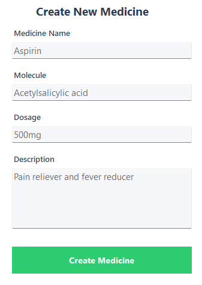

#### Overview
The Medicine Creator is a modal dialog form that provides a clean, focused interface for adding new pharmaceutical entries to the database. This form implements comprehensive validation and user-friendly keyboard navigation.

#### Technical Implementation

**Form Components:**
- **Medicine Name Field**: Text input for the trade name (required, max 150 characters)
- **Molecule Field**: Text input for the active pharmaceutical ingredient (required, max 150 characters)
- **Dosage Field**: Text input for strength/concentration (required, max 100 characters)
- **Description Area**: Multi-line text area for therapeutic information (optional, unlimited)
- **Create Medicine Button**: Large green button to submit the form

**Validation Rules:**

1. **Required Field Validation**:
   - Medicine Name must not be empty
   - Molecule must not be empty
   - Dosage must not be empty
   - If any required field is empty, displays: "Please fill in all required fields (Name, Molecule, and Dosage)"

2. **Length Validation**:
   - Database constraints enforce maximum lengths
   - Truncation occurs if exceeded (though not explicitly validated in UI)

**Creation Workflow:**

1. **User Input**: Doctor fills in the form fields with medicine information

2. **Form Submission**: Clicking "Create Medicine" triggers validation and creation process

3. **Data Object Creation**:
   ```csharp
   Medicine newMedicine = new Medicine
   {
       Name = medicineName,
       Molecule = molecule,
       Dosage = dosage,
       Description = description,
       id_user = currentUserId  // Associates with logged-in doctor
   };
   ```

4. **Database Insertion**: `MedicineDAO.Create()` executes:
   ```sql
   INSERT INTO Medicine (name, molecule, dosage, description, id_user)
   VALUES (@name, @molecule, @dosage, @description, @id_user);
   ```

5. **Success Feedback**:
   - Success message displays: "Medicine created successfully!"
   - Form fields automatically clear for rapid sequential entry
   - Form remains open for adding additional medicines
   - User can close the form to return to the main medicine grid

6. **Grid Update**: Upon closing the creator form, the main `DoctorForm` refreshes the medicine grid via `LoadMedicines()`

**Example Data Entry** (as shown in screenshot):
- **Medicine Name**: Aspirin
- **Molecule**: Acetylsalicylic acid
- **Dosage**: 500mg
- **Description**: Pain reliever and fever reducer

**Form Behavior:**
- **Modal Dialog**: Blocks interaction with parent form until closed
- **Auto-Clear**: Fields reset after successful creation for efficiency
- **Stay-Open Pattern**: Form doesn't auto-close, allowing multiple consecutive entries
- **Cancel Option**: Closing the form (X button) cancels without creating

**Error Handling:**
- Database connection errors: "Error creating medicine: [error details]"
- Duplicate entries: Allowed (no unique constraint on medicine name)
- Foreign key errors: Prevented by passing valid user ID

**Database Impact:**
- New record inserted with auto-increment `id_medicine` primary key
- Foreign key `id_user` creates relationship to the User table
- Record becomes immediately available for prescription creation
- Associated with the doctor who created it (audit trail)

**Code Location**: [Forms/MedecineCreatorForm.cs:15-87](Forms/MedecineCreatorForm.cs#L15-L87)

---

### Patients Management

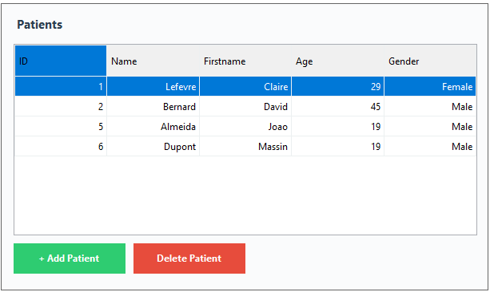

#### Overview
The Patients tab provides a comprehensive view of all patient records in the system. Unlike the medicines tab, this grid is read-only by design, requiring dedicated forms for creation and modification to ensure data integrity for sensitive patient information.

#### Technical Implementation

**DataGridView Configuration:**
- **Columns Displayed**:
  - `ID`: Patient's unique identifier (primary key)
  - `Name`: Patient's last name
  - `Firstname`: Patient's first name
  - `Age`: Patient's age in years (optional)
  - `Gender`: Displayed as "Male" or "Female" (stored as boolean in database)

- **Grid Properties**:
  - `ReadOnly = true`: No inline editing allowed for patient data
  - `AllowUserToAddRows = false`: Creation only via "+ Add Patient" button
  - `AllowUserToDeleteRows = false`: Deletion controlled via "Delete Patient" button
  - `SelectionMode = FullRowSelect`: Entire row selection for prescription creation

**Key Features:**

**1. View All Patients**
- Displays all patients in the system across all doctors
- Data loaded via `PatientDAO.GetAll()`, which performs a JOIN with the User table:
  ```sql
  SELECT pa.*, u.id_user, u.name AS user_name, u.firstname AS user_firstname,
         u.role AS user_role, u.email AS user_email
  FROM Patient pa
  JOIN User u ON pa.id_user = u.id_user;
  ```
- Shows which doctor created each patient record (though not displayed in this view)

**2. Gender Display Formatting**
- Database stores gender as boolean: `false = Female`, `true = Male`
- Custom cell formatting converts boolean to readable text:
  ```csharp
  e.Value = genderValue ? "Male" : "Female";
  ```
- Provides better user experience than displaying "True/False"

**3. Add New Patient**
- Clicking the green **"+ Add Patient"** button opens the [Patient Creator Form](#-patient-creator-form)
- Modal dialog ensures focus on patient creation
- New patients are automatically associated with the logged-in doctor
- Grid refreshes automatically after creation

**4. Delete Patient**
- Select a patient row by clicking anywhere on it
- Click the red **"Delete Patient"** button
- Confirmation dialog appears: "Are you sure you want to delete this patient?"
- If confirmed:
  1. Executes `PatientDAO.Delete(patientId)`:
     ```sql
     DELETE FROM Patient WHERE id_patient = @id_patient;
     ```
  2. **Cascade Deletes**: Automatically removes all associated prescriptions and their medicine relationships (via `ON DELETE CASCADE`)
  3. Success message: "Patient deleted successfully"
  4. Grid refreshes to remove the deleted patient

**5. Select Patient for Prescription**
- Selected patient is used when clicking "Create Prescription" in the Prescriptions tab
- Selection persists across tab switches
- Validates that a patient is selected before allowing prescription creation

**Example Data Shown:**
| ID | Name | Firstname | Age | Gender |
|----|------|-----------|-----|--------|
| 1 | Lefevre | Claire | 29 | Female |
| 2 | Bernard | David | 45 | Male |
| 5 | Almeida | Joao | 19 | Male |
| 6 | Dupont | Massin | 19 | Male |

**Data Integrity Considerations:**

**Why Read-Only?**
- Patient data is sensitive health information requiring careful validation
- Prevents accidental modifications during casual browsing
- Ensures all changes go through proper validation workflows
- Maintains audit trail of modifications (would require dedicated edit form)

**Cascade Delete Impact:**
- Deleting a patient removes ALL their prescriptions
- All medicine-prescription relationships (Appartient table) are also deleted
- **Warning**: This is permanent and irreversible
- Confirmation dialog helps prevent accidental deletions

**Technical Details:**
- Data binding uses `BindingList<Patient>` for automatic UI updates
- Patient objects include navigation property to User (doctor who created record)
- Age field is nullable in database (`int?` in C# model)
- Gender field is nullable but typically required at creation

**Code Location**: [Forms/DoctorForm.cs:245-312](Forms/DoctorForm.cs#L245-L312)

---

### Patient Creator Form

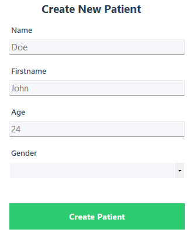

#### Overview
The Patient Creator form is a specialized modal dialog for registering new patients in the system. It collects essential demographic information and associates the patient with the currently logged-in doctor for proper record tracking.

#### Technical Implementation

**Form Components:**
- **Name Field**: Patient's last name (required, max 100 characters)
- **Firstname Field**: Patient's first name (required, max 100 characters)
- **Age Field**: Patient's age in years (optional, integer only)
- **Gender Dropdown**: ComboBox with options "Male" or "Female" (required)
- **Create Patient Button**: Large green button to submit the form

**Validation Rules:**

1. **Required Fields**:
   - Name must not be empty
   - Firstname must not be empty
   - Gender must be selected
   - If validation fails: "Please fill in all required fields (Name, Firstname, and Gender)"

2. **Age Validation**:
   - Age is optional (can be left blank)
   - If provided, must be a valid integer
   - If invalid: "Please enter a valid age"

3. **Gender Validation**:
   - Must select either "Male" or "Female" from dropdown
   - Cannot be left blank
   - Dropdown prevents invalid entries

**Creation Workflow:**

1. **User Input**: Doctor fills in patient information

2. **Gender Conversion**: Dropdown text converted to boolean:
   ```csharp
   bool gender = (genderInput == "Male");  // true = Male, false = Female
   ```

3. **Patient Object Creation**:
   ```csharp
   Patient newPatient = new Patient
   {
       Name = name,
       Firstname = firstname,
       Age = age, 
       Gender = gender,  // true/false
       id_user = currentUserId  // Associates with doctor
   };
   ```

4. **Database Insertion**: `PatientDAO.Create()` executes:
   ```sql
   INSERT INTO Patient (name, firstname, age, gender, id_user)
   VALUES (@name, @firstname, @age, @gender, @id_user);
   ```

5. **Success Flow**:
   - Success message: "Patient created successfully!"
   - `DialogResult.OK` returned to calling form
   - Form automatically closes
   - Parent form refreshes patient grid

**Example Data Entry** (as shown in screenshot):
- **Name**: Doe
- **Firstname**: John
- **Age**: 24
- **Gender**: (Dropdown - requires selection of Male or Female)

**Gender Dropdown Configuration:**
- **Items**: ["Male", "Female"]
- **Style**: `DropDownList` (user cannot type custom values)
- **Default**: No selection (blank initially)
- **Binding**: String values converted to boolean for database storage

**Form Behavior:**

**Modal Dialog Pattern**:
- Blocks interaction with DoctorForm until closed
- Focus lock ensures data entry completion
- X button closes without creating (DialogResult.Cancel)

**Data Ownership**:
- Every patient is "owned" by the doctor who created them via `id_user` foreign key
- Establishes doctor-patient relationship in the database
- Used for audit trails and data attribution

**Error Handling:**

1. **Validation Errors**:
   - Empty required fields → Field-specific error messages
   - Invalid age → "Please enter a valid age"
   - Missing gender → "Please fill in all required fields"

2. **Database Errors**:
   - Connection failure → "Error creating patient: [error details]"
   - Foreign key violation → "Error: Invalid user ID"

**Database Impact:**
- New record with auto-increment `id_patient` primary key
- Foreign key `id_user` creates link to User table
- Age stored as integer
- Gender stored as boolean (0 = Female, 1 = Male)
- Record immediately available for prescription creation

**User Experience Enhancements:**

1. **Tab Order**: Natural flow from Name → Firstname → Age → Gender → Create button
2. **Enter Key Support**: Pressing Enter moves to next field
3. **Clear Labels**: Each field clearly labeled with no ambiguity
4. **Dropdown**: Prevents invalid gender entries through controlled selection
5. **Auto-Close**: Form doesn't stay open after creation

**Code Location**: [Forms/PatientCreatorForm.cs:18-74](Forms/PatientCreatorForm.cs#L18-L74)

---

### Prescriptions Management

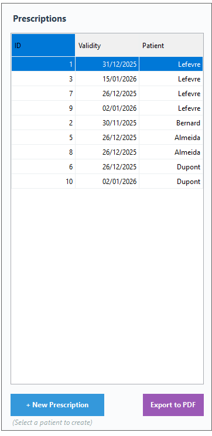

#### Overview
The Prescriptions tab serves as the central hub for viewing all prescriptions in the system, creating new prescriptions for patients, and exporting prescriptions to professional PDF documents. This interface integrates patient data, prescription records, and document generation capabilities.

#### Technical Implementation

**DataGridView Configuration:**
- **Columns Displayed**:
  - `ID`: Prescription unique identifier (primary key)
  - `Validity`: Expiration date of the prescription (format: DD/MM/YYYY)
  - `Patient`: Patient's last name (foreign key relationship)

- **Grid Properties**:
  - `ReadOnly = true`: Prescriptions cannot be edited once created (intentional design)
  - `SelectionMode = FullRowSelect`: Enables selection for PDF export
  - Auto-sized columns based on content

**Key Features:**

**1. View All Prescriptions**
- Displays comprehensive list of all prescriptions across all patients
- Data loaded via `PrescriptionDAO.GetAll()`, which performs complex JOINs:
  ```sql
  SELECT pr.*,
         pa.id_patient, pa.name AS patient_name, pa.firstname AS patient_firstname,
         pa.age AS patient_age, pa.gender AS patient_gender,
         u.id_user, u.name AS user_name, u.firstname AS user_firstname,
         u.role AS user_role, u.email AS user_email
  FROM Prescription pr
  JOIN Patient pa ON pr.id_patient = pa.id_patient
  JOIN User u ON pr.id_user = u.id_user;
  ```
- Shows prescription ID, validity date, and associated patient

**2. Patient Display Formatting**
- Patient column shows last name only for compact display
- Full patient details available in the prescription object
- Custom cell formatting extracts patient name from Patient object:
  ```csharp
  if (e.Value is Patient patient)
  {
      e.Value = patient.Name;
      e.FormattingApplied = true;
  }
  ```

**3. Create New Prescription**
- Blue **"+ New Prescription"** button initiates prescription creation
- **Prerequisite**: A patient must be selected in the Patients tab first
- Validation check: "Please select a patient from the Patients tab first"
- Opens the [Prescription Creation Form](#-prescription-creation-form) for the selected patient

**4. Export to PDF**
- Purple **"Export to PDF"** button generates professional prescription document
- **Prerequisite**: A prescription must be selected from the grid
- Opens `SaveFileDialog` for user to choose export location
- Default filename: `Prescription_[PatientName].pdf`

**Example Data Shown:**
| ID | Validity | Patient |
|----|----------|---------|
| 1 | 31/12/2025 | Lefevre |
| 3 | 15/01/2026 | Lefevre |
| 7 | 26/12/2025 | Lefevre |
| 9 | 02/01/2026 | Lefevre |
| 2 | 30/11/2025 | Bernard |
| 5 | 26/12/2025 | Almeida |
| 8 | 26/12/2025 | Almeida |
| 6 | 26/12/2025 | Dupont |
| 10 | 02/01/2026 | Dupont |

**Prescription Creation Workflow:**

1. **Patient Selection**: Doctor selects patient from Patients tab
2. **Click Create**: "+ New Prescription" button
3. **Form Opens**: PrescriptionForm displays with patient name in title
4. **Add Medicines**: Doctor selects medicines and quantities
5. **Submit**: "Create Prescription" button
6. **Database Operations**:
   - Create Prescription record with auto-generated validity date (30 days from creation)
   - Insert into Prescription table (returns new ID)
   - For each selected medicine, insert into Appartient table
7. **Grid Refresh**: New prescription appears in the grid

**PDF Export Workflow:**

1. **Prescription Selection**: Doctor clicks on a prescription row in the grid
2. **Export Click**: "Export to PDF" button
3. **Data Retrieval**:
   - Fetch full prescription details via `PrescriptionDAO.Get(id)`
   - Retrieve all medicines in prescription via `AppartientDAO.GetMedicinesForPrescription(id)`
4. **File Dialog**: SaveFileDialog prompts for save location
5. **PDF Generation**: See [PDF Export Details](#-prescription-pdf-export) below
6. **Auto-Open**: PDF automatically opens in default viewer
7. **Success Message**: "PDF exported successfully!"

**Prescription PDF Export**

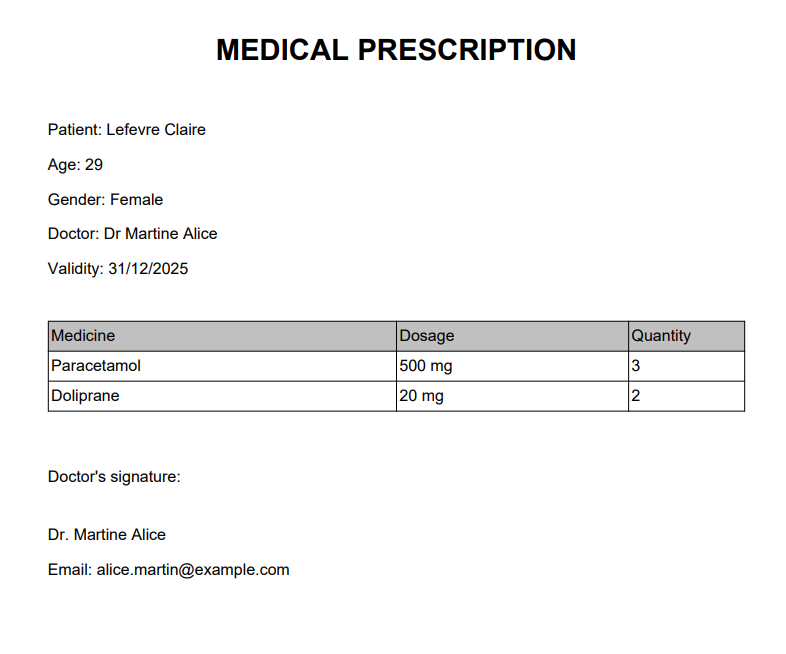

#### PDF Document Structure

The exported PDF is a professionally formatted medical prescription document generated using the iText7 library.

**Document Components:**

**1. Header Section**
- **Title**: "MEDICAL PRESCRIPTION" (large, bold, centered)
- Professional appearance with clear document identification

**2. Patient Information Block**
- **Patient**: Full name (Firstname + Lastname)
- **Age**: Patient's age in years
- **Gender**: "Male" or "Female" (converted from boolean)
- Clearly formatted for quick patient identification

**3. Doctor Information**
- **Doctor**: Title ("Dr") + Doctor's full name
- Identifies the prescribing physician

**4. Prescription Metadata**
- **Validity**: Expiration date of prescription (typically 30 days from issue)
- Format: DD/MM/YYYY

**5. Medicine Table**
- **Columns**: Medicine | Dosage | Quantity
- **Data**: All medicines included in the prescription with:
  - Medicine trade name
  - Dosage strength (e.g., "500 mg", "20 mg")
  - Quantity prescribed (number of units)
- Professional table formatting with borders and aligned columns

**6. Doctor's Signature Block**
- **Label**: "Doctor's signature:"
- **Doctor Name**: Repeated for verification
- **Email**: Doctor's contact email
- Space for physical signature

**Example PDF Content** (from screenshot):

```
MEDICAL PRESCRIPTION

Patient: Lefevre Claire
Age: 29
Gender: Female
Doctor: Dr Martine Alice
Validity: 31/12/2025

┌─────────────┬─────────┬──────────┐
│ Medicine    │ Dosage  │ Quantity │
├─────────────┼─────────┼──────────┤
│ Paracetamol │ 500 mg  │ 3        │
│ Doliprane   │ 20 mg   │ 2        │
└─────────────┴─────────┴──────────┘

Doctor's signature:

Dr. Martine Alice
Email: alice.martin@example.com
```

**Technical Implementation:**

**iText7 PDF Generation Code:**
```csharp
// Create document
PdfWriter writer = new PdfWriter(filePath);
PdfDocument pdf = new PdfDocument(writer);
Document document = new Document(pdf);

// Add title
Paragraph title = new Paragraph("MEDICAL PRESCRIPTION")
    .SetTextAlignment(TextAlignment.CENTER)
    .SetFontSize(20)
    .SetBold();
document.Add(title);

// Add patient info
document.Add(new Paragraph($"Patient: {patient.Firstname} {patient.Name}"));
document.Add(new Paragraph($"Age: {patient.Age}"));
document.Add(new Paragraph($"Gender: {(patient.Gender ? "Male" : "Female")}"));

// Add doctor info
document.Add(new Paragraph($"Doctor: Dr {doctor.Firstname} {doctor.Name}"));

// Add validity
document.Add(new Paragraph($"Validity: {prescription.Validity:dd/MM/yyyy}"));

// Create medicine table
Table table = new Table(3);
table.AddHeaderCell("Medicine");
table.AddHeaderCell("Dosage");
table.AddHeaderCell("Quantity");

foreach (var appartient in medicines)
{
    table.AddCell(appartient.Medicine.Name);
    table.AddCell(appartient.Medicine.Dosage);
    table.AddCell(appartient.Quantity.ToString());
}
document.Add(table);

// Add signature block
document.Add(new Paragraph("Doctor's signature:"));
document.Add(new Paragraph($"Dr. {doctor.Firstname} {doctor.Name}"));
document.Add(new Paragraph($"Email: {doctor.Email}"));

document.Close();
```

**PDF Properties:**
- **Page Size**: A4 (standard international)
- **Margins**: Default margins (approx. 36pt all sides)
- **Font**: Helvetica (system default)
- **Encoding**: UTF-8 (supports international characters)
- **File Size**: Typically 5-15 KB depending on content

**Use Cases:**
- Patient receives printed prescription for pharmacy
- Electronic medical records archival
- Insurance claim documentation
- Pharmacy dispensing verification
- Medical audit trails

**Error Handling:**
- No prescription selected: "Please select a prescription to export"
- File access denied: "Error accessing file: [error details]"
- Database retrieval error: "Error fetching prescription data: [error details]"
- PDF generation error: Detailed exception message displayed

**Code Location**: [Forms/DoctorForm.cs:314-425](Forms/DoctorForm.cs#L314-L425)

---

### Prescription Creation Form

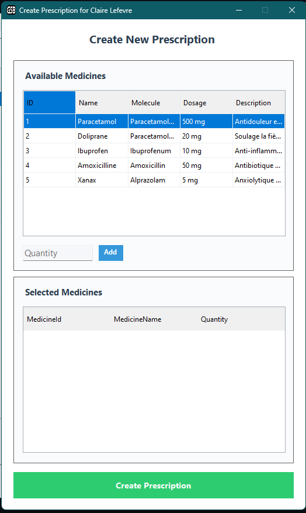
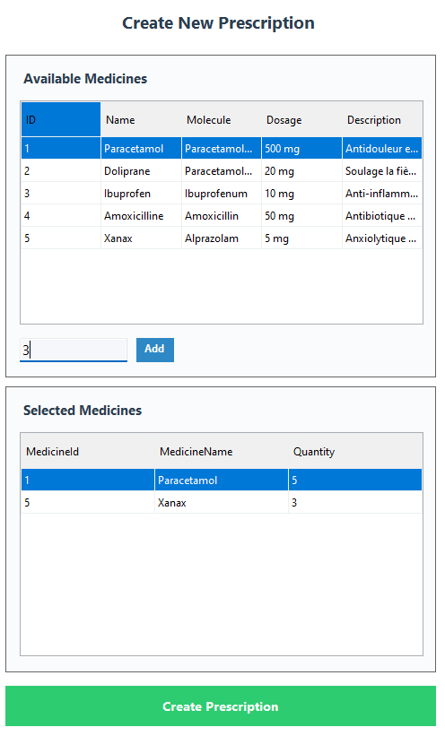

#### Overview
The Prescription Creation Form is a sophisticated dual-grid interface that enables doctors to build multi-medicine prescriptions with precise quantity control. This form implements a medicine selection workflow where doctors browse available medicines, specify quantities, and compile a complete prescription before submission.

#### Technical Implementation

**Form Layout:**

**Top Section: Available Medicines Grid**
- **Purpose**: Browse and select medicines to add to prescription
- **Columns**:
  - `ID`: Medicine primary key
  - `Name`: Trade name
  - `Molecule`: Active pharmaceutical ingredient
  - `Dosage`: Strength/concentration
  - `Description`: Therapeutic information
- **Properties**:
  - `ReadOnly = true`: No editing allowed
  - `SelectionMode = FullRowSelect`: Click anywhere on row to select

**Middle Section: Add Medicine Controls**
- **Quantity Input**: Numeric text field for specifying number of units
- **Add Button**: Blue button to add selected medicine to prescription

**Bottom Section: Selected Medicines Grid**
- **Purpose**: Display medicines that will be included in the prescription
- **Columns**:
  - `MedicineId`: Hidden (used for database operations)
  - `MedicineName`: Display name of selected medicine
  - `Quantity`: Number of units prescribed
- **Properties**:
  - `ReadOnly = true`: Review only (remove by reselecting and re-adding with 0 quantity)

**Bottom Button: Create Prescription**
- **Large green button**: Submits the prescription to the database

**Form Title Bar:**
- Dynamic: "Create Prescription for [Patient Name]"
- Provides context about which patient the prescription is for

**Medicine Selection Workflow:**

**Step 1: Select Medicine from Available Medicines**
1. Doctor clicks on a medicine row in the top grid
2. Medicine details are captured from the selected row
3. Selection highlighted in blue

**Step 2: Enter Quantity**
1. Doctor types quantity in the "Quantity" text box
2. Must be a positive integer
3. No validation until "Add" button clicked

**Step 3: Click Add Button**
1. System validates:
   - A medicine is selected from top grid
   - Quantity field is not empty
   - Quantity is a valid positive integer

2. **Duplicate Check**: System checks if medicine already in Selected Medicines grid
   - If YES: Updates quantity with new value (overwrites previous)
   - If NO: Adds new row to Selected Medicines grid

3. **Helper Class**: Uses `MedicineSelection` class for data binding:
   ```csharp
   public class MedicineSelection
   {
       public int MedicineId { get; set; }
       public string MedicineName { get; set; }
       public int Quantity { get; set; }
   }
   ```

4. Selected medicines stored in private list: `List<MedicineSelection> _selectedMedicines`

**Step 4: Review Selected Medicines**
- Doctor can see all added medicines in bottom grid
- Can verify medicines and quantities before submission

**Step 5: Create Prescription**
1. Doctor clicks green "Create Prescription" button

2. **Final Validation**:
   - At least one medicine must be selected
   - If no medicines: "Please add at least one medicine to the prescription"

3. **Validity Date Calculation**:
   ```csharp
   DateTime validity = DateTime.Now.AddMonths(1);  // 30 days from today
   ```

4. **Prescription Object Creation**:
   ```csharp
   Prescription newPrescription = new Prescription
   {
       id_patient = selectedPatientId,
       id_user = currentUserId,
       Validity = validity
   };
   ```

5. **Database Operations** (Two-step process):

   **Step 5a: Create Prescription Record**
   ```sql
   INSERT INTO Prescription (id_patient, id_user, validity)
   VALUES (@id_patient, @id_user, @validity);
   SELECT LAST_INSERT_ID();  -- Returns new prescription ID
   ```

   **Step 5b: Add Medicines to Prescription**
   For each medicine in `_selectedMedicines` list:
   ```sql
   INSERT INTO Appartient (id_prescription, id_medicine, quantity)
   VALUES (@id_prescription, @id_medicine, @quantity);
   ```

6. **Success Flow**:
   - Success message: "Prescription created successfully!"
   - Form closes automatically
   - Parent form refreshes prescription grid
   - New prescription appears with current date validity

**Example Workflow** (from screenshots):

**Empty State (createprescription.png)**:
- Available medicines grid shows all medicines (Paracetamol, Doliprane, Ibuprofen, Amoxicilline, Xanax)
- Quantity field empty
- Selected Medicines grid empty
- Title: "Create Prescription for Claire Lefevre"

**Filled State (filledcreateprescription.png)**:
- Quantity input shows "3"
- Selected Medicines grid contains:
  - ID: 1, Medicine: Paracetamol, Quantity: 5
  - ID: 5, Medicine: Xanax, Quantity: 3
- Ready for submission via "Create Prescription" button

**Technical Details:**

**Data Loading:**
- Available medicines loaded via `MedicineDAO.GetAll()` on form open
- Ensures all medicines in database are available for selection
- No filtering by doctor (all medicines shared across system)

**Quantity Management:**
- No decimal quantities (integer only)
- Quantity field cleared after each "Add" click for rapid entry

**Duplicate Prevention:**
- Medicine can only appear once in Selected Medicines grid
- Adding same medicine again updates quantity (replaces previous value)
- Implementation:
  ```csharp
  var existing = _selectedMedicines.FirstOrDefault(m => m.MedicineId == selectedMedicineId);
  if (existing != null)
      existing.Quantity = newQuantity;  // Update
  else
      _selectedMedicines.Add(newMedicine);  // Add new
  ```

**Transaction Considerations:**
- Prescription creation and medicine additions are separate SQL operations
- Not wrapped in explicit transaction (potential improvement area)
- If medicine additions fail, prescription record already exists (orphaned record possible)
- Cascade delete would clean up if prescription deleted

**Error Handling:**

1. **Validation Errors**:
   - No medicine selected: "Please select a medicine"
   - Empty quantity: "Please enter a quantity"
   - Invalid quantity: "Quantity must be a positive number"
   - No medicines added: "Please add at least one medicine to the prescription"

2. **Database Errors**:
   - Prescription creation failure: "Error creating prescription: [details]"
   - Medicine addition failure: "Error adding medicine to prescription: [details]"
   - Foreign key violations: Prevented by UI logic (patient and user IDs validated before opening form)

**User Experience Features:**

1. **Visual Context**: Patient name in title bar keeps doctor informed
2. **Two-Grid Design**: Separates browsing from selection
3. **Inline Quantity**: Add quantity without opening another form
4. **Rapid Entry**: Can add multiple medicines quickly
5. **Review Before Submit**: Bottom grid provides verification opportunity
6. **Auto-Close**: Form closes after successful creation (no manual dismiss needed)

**Code Location**: [Forms/PrescriptionForm.cs:19-156](Forms/PrescriptionForm.cs#L19-L156)

---

## 3. Admin Interface

The Admin interface provides comprehensive user management capabilities, accessible only to users with admin privileges (Role = true).

---

### Admin User Management

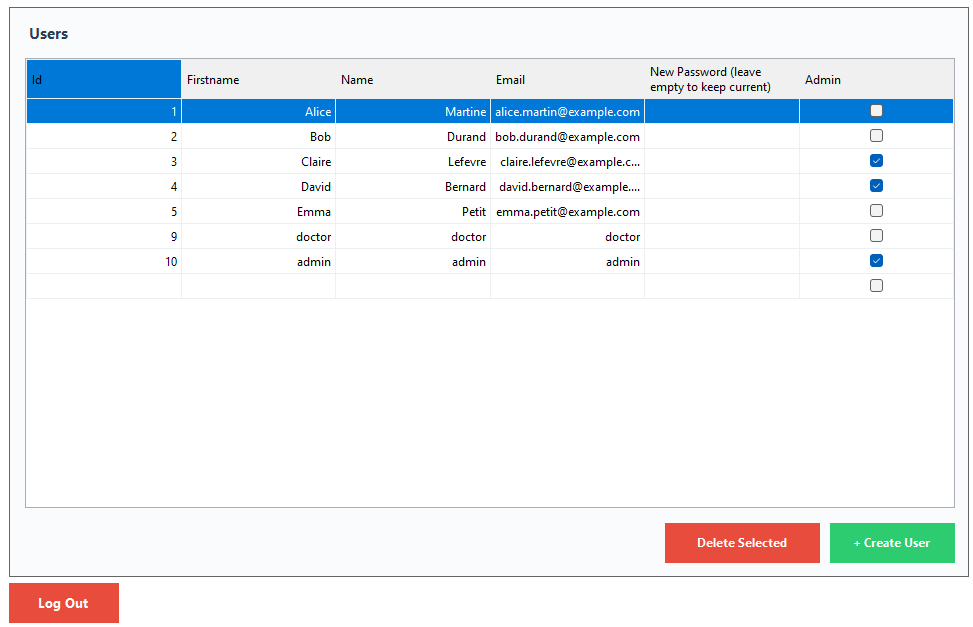

#### Overview
The Admin Page is a user management interface that allows administrators to view, create, edit, and delete system users (both doctors and administrators). This interface features advanced inline editing capabilities with real-time database synchronization.

#### Technical Implementation

**DataGridView Configuration:**
- **Columns Displayed**:
  - `Id`: User primary key (read-only for existing users)
  - `Firstname`: User's first name (editable)
  - `Name`: User's last name (editable)
  - `Email`: User's email address (editable, must be unique)
  - `New Password (leave empty to keep current)`: Optional password reset field
  - `Admin`: Checkbox for role assignment (true = Admin, false = Doctor)

- **Grid Properties**:
  - `AllowUserToAddRows = true`: New row appears at bottom for user creation
  - `AllowUserToDeleteRows = true`: Can select and delete rows (requires confirmation)
  - `ReadOnly = false`: Inline editing enabled
  - `EditMode = EditOnEnter`: Single-click to edit cells

**Key Features:**

**1. View All Users**
- Displays complete list of system users (doctors and admins)
- Data loaded via `UserDAO.GetAll()`:
  ```sql
  SELECT * FROM User;
  ```
- Shows user details and role status
- Current logged-in admin visible in list

**2. Inline User Editing**
- Click any cell to edit directly in the grid
- Changes apply immediately when you move to another cell
- `CellValueChanged` event triggers on cell exit

**Edit Workflow:**
```csharp
private void UsersDataGridView_CellValueChanged(object sender, DataGridViewCellEventArgs e)
{
    var userDisplay = userDisplayList[e.RowIndex];

    if (userDisplay.Id == 0)
        CreateNewUser(userDisplay);  // New user (blank row)
    else
        UpdateExistingUser(userDisplay, e.ColumnIndex);  // Existing user
}
```

**3. Update Existing Users**
- Edit name, firstname, email, or admin status
- Password field can be used to reset user passwords

**Update Logic:**

**Name/Email/Role Changes:**
```sql
UPDATE User
SET firstname = @firstname,
    name = @name,
    email = @email,
    role = @role
WHERE id_user = @id;
```

**Password Reset (if New Password field has content):**
```sql
UPDATE User
SET password = SHA2(@password, 256)
WHERE id_user = @id;
```

- Password hashed with SHA-256 before storage
- User must sign in again with new password
- Password field clears after update

**4. Create New User**
- Scroll to bottom of grid and edit the empty row
- Fill in: Firstname, Name, Email, Password (required)
- Check "Admin" box if admin privileges needed
- Press Enter or click away to trigger creation

**Creation Process:**

1. **Detection**: System detects `Id == 0` (new user indicator)

2. **Validation**:
   - All fields (except New Password after creation) must be filled
   - Email must be unique in database
   - If validation fails: "Please fill in all fields"

3. **Database Insertion**:
   ```sql
   INSERT INTO User (firstname, name, email, password, role)
   VALUES (@firstname, @name, @email, SHA2(@password, 256), @role);
   ```

4. **Post-Creation**:
   - Success message: "User created successfully!"
   - Grid refreshes with new user ID assigned
   - Password field clears for security

**5. Delete User**
- Select a user row by clicking the row header (numbered column on left)
- Click red "Delete Selected" button
- Confirmation dialog: "Are you sure you want to delete this user?"

**Deletion Impact:**
- Executes `UserDAO.Delete(userId)`:
  ```sql
  DELETE FROM User WHERE id_user = @id_user;
  ```
- **Cascade Deletes** ALL associated data:
  - All patients created by user
  - All medicines created by user
  - All prescriptions created by user
  - All medicine-prescription relationships (Appartient)
- **Irreversible Operation**: No soft delete or recovery mechanism
- Success message: "User deleted successfully!"

**6. Create User via Button**
- Click green "+ Create User" button
- Opens [User Creator Form](#-user-creator-form) modal dialog
- Alternative to inline creation
- Same result as editing empty row in grid

**7. Logout**
- Red "Log Out" button in bottom-left corner
- Closes AdminForm and returns to login screen (MainForm)
- No session persistence (must sign in again)

**Example Data Shown:**
| Id | Firstname | Name | Email | New Password | Admin |
|----|-----------|------|-------|--------------|-------|
| 1 | Alice | Martine | alice.martin@example.com | | ☑ |
| 2 | Bob | Durand | bob.durand@example.com | | ☐ |
| 3 | Claire | Lefevre | claire.lefevre@example.com | | ☑ |
| 4 | David | Bernard | david.bernard@example... | | ☑ |
| 5 | Emma | Petit | emma.petit@example.com | | ☐ |
| 9 | doctor | doctor | doctor | | ☐ |
| 10 | admin | admin | admin | | ☑ |

**Data Binding:**
```csharp
BindingList<UserDisplay> userDisplayList = new BindingList<UserDisplay>();
usersDataGridView.DataSource = userDisplayList;
```

**Real-Time Updates:**
- `CellValueChanged` event fires immediately on cell exit
- Database updates in real-time (no "Save" button needed)
- Grid refreshes to show updated data
- Optimistic UI updates (assumes success)

**Column Configuration:**
```csharp
// Hide navigation properties
usersDataGridView.Columns["Password"].Visible = false;  // Hash never displayed

// Password column header
usersDataGridView.Columns["NewPassword"].HeaderText = "New Password (leave empty to keep current)";

// Admin column as checkbox
usersDataGridView.Columns["Admin"].HeaderText = "Admin";
```

**Security Considerations:**

**Password Management:**
- SHA-256 hashing prevents plaintext storage
- Admins can reset any user's password
- No notification to user when admin resets password

**Role Management:**
- Admins can promote doctors to admin or demote admins to doctors
- No audit trail of role changes

**User Deletion:**
- Extremely destructive operation (cascades to all user data)
- Only confirmation dialog prevents accidental deletion

**Email Uniqueness:**
- Database enforces UNIQUE constraint on email
- Duplicate email attempts result in error: "Email already exists"

**Error Handling:**

1. **Validation Errors**:
   - Empty fields: "Please fill in all fields"
   - Invalid email format: Not validated (accepts any string)
   - Duplicate email: "Email already exists in the system"

2. **Database Errors**:
   - Connection failure: "Error accessing database: [details]"
   - Foreign key violations: Prevented by UI logic
   - Update conflicts: "Error updating user: [details]"

3. **Permission Errors**:
   - Only admins can access this form (enforced at login routing)

**User Experience Features:**

1. **Inline Editing**: No need to open separate edit forms
2. **Visual Feedback**: Success messages after each operation
3. **Checkbox Rendering**: Role displayed as checkbox (clearer than true/false)
4. **Password Hint**: Column header explains password field behavior
5. **Dual Creation Methods**: Both inline and button-based creation available
6. **Confirmation Dialogs**: Prevents accidental deletions
7. **Auto-Refresh**: Grid updates immediately after operations

**Code Location**: [Forms/AdminForm.cs:15-234](Forms/AdminForm.cs#L15-L234)

---

### User Creator Form

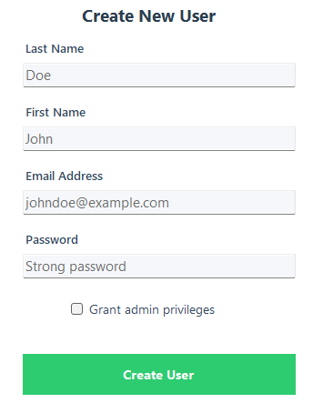

#### Overview
The User Creator Form is a dedicated modal dialog for creating new system users. This form provides a clean, focused interface for administrators to add doctors or other administrators to the system with proper role assignment and credential setup.

#### Technical Implementation

**Form Components:**
- **Last Name Field**: User's last name (required, max 100 characters)
- **First Name Field**: User's first name (required, max 100 characters)
- **Email Address Field**: User's unique email (required, max 150 characters)
- **Password Field**: Initial password for user account (required, max 255 characters)
- **Grant admin privileges**: Checkbox to assign admin role (default: unchecked = Doctor)
- **Create User Button**: Large green button to submit the form

**Validation Rules:**

1. **Required Fields**:
   - Last Name must not be empty
   - First Name must not be empty
   - Email Address must not be empty
   - Password must not be empty
   - If validation fails: "All fields are required"

2. **Email Uniqueness**:
   - Email must be unique in database (UNIQUE constraint)
   - If duplicate: "Email already exists in the system"
   - No format validation (accepts any string)

3. **Password Requirements**:
   - No complexity requirements enforced
   - No minimum length requirement
   - Accepts any non-empty string
   - Potential improvement: Add password strength validation

4. **Role Assignment**:
   - Checkbox unchecked (default) = Doctor (Role = false)
   - Checkbox checked = Administrator (Role = true)

**Creation Workflow:**

1. **Form Opening**: Triggered by "+ Create User" button in AdminForm

2. **User Input**: Administrator fills in all required fields
   - Types last name, first name, email, and password
   - Checks "Grant admin privileges" if admin role needed

3. **User Object Creation**:
   ```csharp
   User newUser = new User
   {
       Name = lastName,
       Firstname = firstName,
       Email = email,
       Password = password,  // Will be hashed in DAO
       Role = isAdmin       // true = Admin, false = Doctor
   };
   ```

4. **Database Insertion**: `UserDAO.Create()` executes:
   ```sql
   INSERT INTO User (firstname, name, email, password, role)
   VALUES (@firstname, @name, @email, SHA2(@password, 256), @role);
   ```

5. **Password Hashing**: SHA-256 hashing performed at database level:
   - Input: Plain text password (e.g., "Strong password")
   - Output: 64-character hexadecimal hash
   - Example: `5e884898da28047151d0e56f8dc6292773603d0d6aabbdd62a11ef721d1542d8`

6. **Success Flow**:
   - Success message: "User created successfully!"
   - `DialogResult.OK` returned to AdminForm
   - Form closes automatically
   - AdminForm refreshes user grid
   - New user appears in the list

**Example Data Entry** (from screenshot):
- **Last Name**: Doe
- **First Name**: John
- **Email Address**: johndoe@example.com
- **Password**: Strong password
- **Grant admin privileges**: Unchecked (will be Doctor)

**Form Behavior:**

**Modal Dialog Pattern**:
- Blocks interaction with AdminForm until closed
- Focus on user creation task
- X button closes without creating (DialogResult.Cancel)
- ESC key also cancels creation

**Role Assignment Logic**:
```csharp
bool isAdmin = grantAdminCheckbox.Checked;  // true or false
```

**Field Order (Tab Navigation)**:
1. Last Name → First Name → Email Address → Password → Checkbox → Create Button
2. Natural flow for efficient data entry

**Error Handling:**

1. **Validation Errors**:
   - Empty fields: "All fields are required"
   - Displays MessageBox with error icon
   - Returns focus to form for correction

2. **Database Errors**:
   - Duplicate email: "Email already exists in the system"
   - Connection failure: "Error creating user: [error details]"
   - Invalid data: Database constraint violation messages

3. **Network Errors**:
   - Database connection timeout
   - MySQL server unavailable
   - Generic error message with exception details

**Security Considerations:**

**Password Handling**:
- Plain text password entered in form
- Transmitted to DAO in plain text (same process)
- Hashed only at database insertion time via SHA2() function
- Password never stored in plain text in database
- Improvement: Hash on client side before transmission

**Email as Username**:
- Email serves as unique identifier (username)
- No separate username field
- Enforces email format as login credential
- Improvement: Add email format validation

**Admin Privilege Assignment**:
- Any admin can create other admins (no super-admin concept)
- No restriction on admin creation
- Checkbox makes role assignment explicit and visible

**Default Role**:
- Defaults to Doctor role (checkbox unchecked)
- Safer default (principle of least privilege)
- Admin role must be explicitly selected

**Database Impact:**

**New User Record:**
```
id_user: [Auto-increment primary key]
firstname: "John"
name: "Doe"
email: "johndoe@example.com"
password: [SHA-256 hash of "Strong password"]
role: false (Doctor) or true (Admin)
```

**Immediate Effects:**
- User can log in immediately with provided credentials
- Doctor users can access DoctorForm
- Admin users can access AdminForm
- User has no associated patients, medicines, or prescriptions yet

**User Experience Features:**

1. **Clear Labels**: Each field has explicit label (not just column header)
2. **Logical Layout**: Vertical form layout with good spacing
3. **Visual Hierarchy**: Large green button for primary action
4. **Checkbox Label**: "Grant admin privileges" is more descriptive than "Admin"
5. **Modal Focus**: Dedicated window prevents distraction
6. **Auto-Close**: No manual dismissal needed after success

**Code Location**: [Forms/UserCreatorForm.cs:16-62](Forms/UserCreatorForm.cs#L16-L62)

---

## Architecture

### System Architecture Diagram

```
┌─────────────────────────────────────────────────────────────────┐
│                         PRESENTATION LAYER                       │
│                        (Windows Forms UI)                        │
├─────────────────────────────────────────────────────────────────┤
│  ┌─────────────┐  ┌─────────────┐  ┌──────────────────────┐   │
│  │  MainForm   │  │  AdminForm  │  │    DoctorForm        │   │
│  │  (Login)    │  │  (Users)    │  │  (Patients/Meds/Rx)  │   │
│  └─────────────┘  └─────────────┘  └──────────────────────┘   │
│  ┌──────────────────┐  ┌──────────────────┐  ┌──────────────┐ │
│  │ PasswordForm     │  │ UserCreatorForm  │  │ PatientForm  │ │
│  └──────────────────┘  └──────────────────┘  └──────────────┘ │
│  ┌──────────────────┐  ┌────────────────────────────────────┐ │
│  │ MedicineForm     │  │   PrescriptionForm                 │ │
│  └──────────────────┘  └────────────────────────────────────┘ │
└────────────────────────────┬────────────────────────────────────┘
                             │ Uses
                             ▼
┌─────────────────────────────────────────────────────────────────┐
│                       BUSINESS LOGIC LAYER                       │
│                      (Data Access Objects)                       │
├─────────────────────────────────────────────────────────────────┤
│  ┌──────────┐  ┌───────────┐  ┌──────────────┐  ┌───────────┐ │
│  │ UserDAO  │  │PatientDAO │  │ MedicineDAO  │  │ PrescriptionDAO│
│  └──────────┘  └───────────┘  └──────────────┘  └───────────┘ │
│  ┌──────────────┐  ┌──────────────────────────────────────┐   │
│  │ AppartientDAO│  │        Database.cs                   │   │
│  └──────────────┘  └──────────────────────────────────────┘   │
└────────────────────────────┬────────────────────────────────────┘
                             │ Maps to
                             ▼
┌─────────────────────────────────────────────────────────────────┐
│                         DATA MODEL LAYER                         │
│                       (Entity Classes)                           │
├─────────────────────────────────────────────────────────────────┤
│  ┌────────┐  ┌─────────┐  ┌──────────┐  ┌──────────────┐      │
│  │  User  │  │ Patient │  │ Medicine │  │ Prescription │      │
│  └────────┘  └─────────┘  └──────────┘  └──────────────┘      │
│  ┌─────────────┐                                                │
│  │ Appartient  │  (Junction Model)                              │
│  └─────────────┘                                                │
└────────────────────────────┬────────────────────────────────────┘
                             │ Persisted in
                             ▼
┌─────────────────────────────────────────────────────────────────┐
│                          DATA LAYER                              │
│                      (MySQL Database)                            │
├─────────────────────────────────────────────────────────────────┤
│  Database: bts-gsb (MySQL 8.1)                                  │
│  Connection: MySql.Data via ADO.NET                             │
│  Port: 3307 (Docker container)                                  │
│  ┌──────────────────────────────────────────────────────────┐  │
│  │ Tables: User, Patient, Medicine, Prescription, Appartient│  │
│  │ Constraints: Foreign Keys, Cascade Delete, Unique Email  │  │
│  └──────────────────────────────────────────────────────────┘  │
└─────────────────────────────────────────────────────────────────┘
```

### Architectural Patterns

**1. Three-Layer Architecture**
- **Presentation Layer**: Windows Forms (UI logic, event handling, validation)
- **Business Logic Layer**: DAO classes (CRUD operations, SQL queries)
- **Data Layer**: MySQL database (data persistence, constraints)

**2. Data Access Object (DAO) Pattern**
- Abstracts database operations behind clean interfaces
- Each entity has dedicated DAO class
- Encapsulates SQL queries and connection management

**3. Model-View Pattern**
- Models represent database entities with navigation properties
- Forms (Views) display and manipulate models
- No explicit Controller layer (logic in Forms)

### Data Flow Example: Creating a Prescription

```
1. User Action
   └─> Doctor selects patient, clicks "+ New Prescription" button

2. Form Presentation
   └─> PrescriptionForm opens with patient context

3. Medicine Selection
   └─> Doctor selects medicines and quantities
   └─> MedicineSelection objects stored in local list

4. Form Submission
   └─> "Create Prescription" button clicked

5. Prescription Creation (DAO Layer)
   └─> PrescriptionDAO.Create(prescription, userId)
       └─> SQL: INSERT INTO Prescription (id_patient, id_user, validity) VALUES (...)
       └─> Returns: New prescription ID (LAST_INSERT_ID)

6. Medicine Association (DAO Layer)
   └─> For each selected medicine:
       └─> AppartientDAO.AddMedicineToPrescription(prescriptionId, medicineId, quantity)
           └─> SQL: INSERT INTO Appartient (id_prescription, id_medicine, quantity) VALUES (...)

7. Database Persistence
   └─> MySQL stores records with referential integrity

8. UI Update
   └─> Form closes with DialogResult.OK
   └─> DoctorForm refreshes prescription grid
   └─> New prescription visible in grid
```

### Technology Stack Layers

```
┌─────────────────────────────────────────┐
│          Application Layer              │
│  .NET 8.0 Windows Forms (C#)            │
└─────────────────────────────────────────┘
                   ↕
┌─────────────────────────────────────────┐
│         Data Access Layer               │
│  ADO.NET (MySql.Data 9.5.0)             │
│  Parameterized Queries                  │
└─────────────────────────────────────────┘
                   ↕
┌─────────────────────────────────────────┐
│         Database Layer                  │
│  MySQL 8.1 (Docker Container)           │
│  Port: 3307                             │
└─────────────────────────────────────────┘
                   ↕
┌─────────────────────────────────────────┐
│         Infrastructure Layer            │
│  Docker Desktop                         │
│  phpMyAdmin (Port 8080)                 │
└─────────────────────────────────────────┘
```

### Additional Libraries

**PDF Generation:**
- iText7 (v9.4.0): Document creation, layout, tables
- iText7.bouncy-castle-adapter (v9.4.0): Cryptographic functions

**UI Binding:**
- BindingList<T>: Two-way data binding for DataGridView
- DataGridView: Native WinForms control for tabular data

---

## Database Schema

### Entity Relationship Diagram

**Location**: [./diagram.drawio](./diagram.drawio)

### Table Details

#### User Table
```sql
CREATE TABLE User (
    id_user INT AUTO_INCREMENT PRIMARY KEY,
    firstname VARCHAR(100) NOT NULL,
    name VARCHAR(100) NOT NULL,
    role BOOLEAN NOT NULL,              -- false = Doctor, true = Admin
    email VARCHAR(150) UNIQUE NOT NULL,
    password VARCHAR(255) NOT NULL      -- SHA-256 hash (64 chars)
);
```

**Constraints:**
- `email` must be unique
- All fields except `id_user` are required

**Indexes:**
- Primary Key: `id_user`
- Unique Index: `email`

---

#### Patient Table
```sql
CREATE TABLE Patient (
    id_patient INT AUTO_INCREMENT PRIMARY KEY,
    id_user INT NOT NULL,
    name VARCHAR(100) NOT NULL,
    firstname VARCHAR(100) NOT NULL,
    age INT,
    gender BOOLEAN,                     -- false = Female, true = Male
    FOREIGN KEY (id_user) REFERENCES User(id_user)
        ON DELETE CASCADE
        ON UPDATE CASCADE
);
```

**Constraints:**
- `id_user` foreign key to User table
- Cascade delete: Deleting user removes all their patients

**Indexes:**
- Primary Key: `id_patient`
- Foreign Key Index: `id_user`

---

#### Medicine Table
```sql
CREATE TABLE Medicine (
    id_medicine INT AUTO_INCREMENT PRIMARY KEY,
    id_user INT NOT NULL,
    name VARCHAR(150) NOT NULL,
    molecule VARCHAR(150),
    dosage VARCHAR(100),
    description TEXT,
    FOREIGN KEY (id_user) REFERENCES User(id_user)
        ON DELETE CASCADE
        ON UPDATE CASCADE
);
```

**Constraints:**
- `id_user` foreign key to User table
- Cascade delete: Deleting user removes all their medicines

**Indexes:**
- Primary Key: `id_medicine`
- Foreign Key Index: `id_user`

---

#### Prescription Table
```sql
CREATE TABLE Prescription (
    id_prescription INT AUTO_INCREMENT PRIMARY KEY,
    id_patient INT NOT NULL,
    id_user INT NOT NULL,
    validity DATE,
    FOREIGN KEY (id_patient) REFERENCES Patient(id_patient)
        ON DELETE CASCADE
        ON UPDATE CASCADE,
    FOREIGN KEY (id_user) REFERENCES User(id_user)
        ON DELETE CASCADE
        ON UPDATE CASCADE
);
```

**Constraints:**
- `id_patient` foreign key to Patient table
- `id_user` foreign key to User table
- Cascade delete: Deleting patient or user removes prescriptions

**Indexes:**
- Primary Key: `id_prescription`
- Foreign Key Index: `id_patient`
- Foreign Key Index: `id_user`

---

#### Appartient Table (Junction Table)
```sql
CREATE TABLE Appartient (
    id_prescription INT NOT NULL,
    id_medicine INT NOT NULL,
    quantity INT,
    PRIMARY KEY (id_prescription, id_medicine),
    FOREIGN KEY (id_prescription) REFERENCES Prescription(id_prescription)
        ON DELETE CASCADE
        ON UPDATE CASCADE,
    FOREIGN KEY (id_medicine) REFERENCES Medicine(id_medicine)
        ON DELETE CASCADE
        ON UPDATE CASCADE
);
```

**Constraints:**
- Composite primary key: `(id_prescription, id_medicine)`
- No duplicate medicine in same prescription
- Cascade delete: Deleting prescription or medicine removes relationships

**Indexes:**
- Primary Key: `(id_prescription, id_medicine)`
- Foreign Key Index: `id_prescription`
- Foreign Key Index: `id_medicine`

---

### Relationships

**One-to-Many Relationships:**
1. **User → Patient**: One doctor creates many patients
2. **User → Medicine**: One doctor creates many medicines
3. **User → Prescription**: One doctor creates many prescriptions
4. **Patient → Prescription**: One patient has many prescriptions

**Many-to-Many Relationship:**
- **Prescription ↔ Medicine**: One prescription contains many medicines, one medicine appears in many prescriptions
- Junction table: `Appartient` with quantity attribute

### Cascade Behavior

**Delete User → Cascades to:**
- All Patient records where `id_user` matches
  - Which cascades to all Prescription records for those patients
    - Which cascades to all Appartient records for those prescriptions
- All Medicine records where `id_user` matches
  - Which cascades to all Appartient records for those medicines
- All Prescription records where `id_user` matches
  - Which cascades to all Appartient records

**Delete Patient → Cascades to:**
- All Prescription records where `id_patient` matches
  - Which cascades to all Appartient records

**Delete Medicine → Cascades to:**
- All Appartient records where `id_medicine` matches

**Delete Prescription → Cascades to:**
- All Appartient records where `id_prescription` matches

---

## Project Structure

```
bts-gsb-winform/
│
├── DAO/                              # Data Access Objects
│   ├── AppartientDAO.cs             # Prescription-Medicine relationships
│   ├── Database.cs                   # Database connection management
│   ├── MedicineDAO.cs               # Medicine CRUD operations
│   ├── PatientDAO.cs                # Patient CRUD operations
│   ├── PrescriptionDAO.cs           # Prescription CRUD operations
│   └── UserDAO.cs                    # User CRUD and authentication
│
├── Forms/                            # Windows Forms UI
│   ├── AdminForm.cs                  # Admin user management interface
│   ├── AdminForm.Designer.cs        # Admin form UI definition
│   ├── DoctorForm.cs                # Main doctor interface (tabs)
│   ├── DoctorForm.Designer.cs       # Doctor form UI definition
│   ├── MainForm.cs                   # Login screen
│   ├── MainForm.Designer.cs         # Login form UI definition
│   ├── MedecineCreatorForm.cs       # Medicine creation dialog
│   ├── MedecineCreatorForm.Designer.cs
│   ├── PasswordForm.cs              # Password reset interface
│   ├── PasswordForm.Designer.cs
│   ├── PatientCreatorForm.cs        # Patient creation dialog
│   ├── PatientCreatorForm.Designer.cs
│   ├── PrescriptionForm.cs          # Prescription creation interface
│   ├── PrescriptionForm.Designer.cs
│   ├── UserCreatorForm.cs           # User creation dialog
│   └── UserCreatorForm.Designer.cs
│
├── Models/                           # Entity models
│   ├── Appartient.cs                # Prescription-Medicine junction
│   ├── Medicine.cs                   # Medicine entity
│   ├── Patient.cs                    # Patient entity
│   ├── Prescription.cs              # Prescription entity
│   └── User.cs                       # User entity
│
├── Properties/                       # Application resources
│   └── ...                          # Assembly info, resources
│
├── assets/                           # Documentation assets
│   └── images/                      # Screenshots for README
│       ├── adminpage.png
│       ├── createprescription.png
│       ├── filledcreateprescription.png
│       ├── medicinecreator.png
│       ├── medicineprescription.png
│       ├── medicines.png
│       ├── patientcreator.png
│       ├── patients.png
│       ├── prescriptions.png
│       ├── resetpassword.png
│       ├── signin.png
│       └── usercreator.png
│
├── bin/                              # Build output (ignored in git)
│   └── Debug/net8.0-windows/        # Compiled executable
│
├── obj/                              # Intermediate build files
│
├── app.config.cs                    # Configuration file (empty)
├── bts-gsb.csproj                   # Project file
├── bts-gsb.sln                      # Solution file
├── compose.yml                      # Docker Compose for MySQL
├── DATABASE.md                      # Database schema documentation
├── diagram.drawio                   # Architecture diagram
├── Program.cs                        # Application entry point
└── README.md                        # This file
```

### File Responsibilities

**DAO Layer:**
- Handle all database connections
- Execute SQL queries with parameterized statements
- Return domain models (not raw SQL results)
- Throw exceptions with descriptive messages

**Forms Layer:**
- Handle user input and events
- Validate data before passing to DAO
- Display success/error messages to user
- Manage navigation between forms

**Models Layer:**
- Represent database entities
- Define navigation properties for relationships
- Use Data Annotations for validation attributes
- Provide clean object structure for data binding

---

## Security

### Authentication & Authorization

**Password Security:**
- Hashing: SHA-256 (256-bit cryptographic hash)
- Storage: Only hash stored in database (64-character hexadecimal string)
- Login: Password hashed at database level during comparison
- Update: New passwords immediately hashed before storage

**Role-Based Access Control:**
- Two roles: Admin (true) and Doctor (false)
- Route-based authorization: Login redirects based on role
- Interface segregation: Admins and doctors see different forms
- No row-level security: Users can access all records in their interface

### SQL Injection Prevention

**Parameterized Queries:**
All database operations use parameterized statements:
```csharp
command.CommandText = "SELECT * FROM User WHERE email = @email";
command.Parameters.AddWithValue("@email", email);
```

**Benefits:**
- User input treated as data, not executable code
- Prevents malicious SQL injection attacks
- No need for manual escaping of special characters


---

## Credits

**PdfExport by:** [RyukSylux](https://github.com/RyukSylux)

**GitHub Repository:** [bts-gsb-winform](https://github.com/RyukSylux/bts-gsb-winform)

**Academic Context:** BTS SIO SLAM Final Exam Project

**Technologies:**
- Microsoft .NET Framework Team - .NET 8.0
- Oracle Corporation - MySQL Database
- iText Software - iText7 PDF Library
- Docker Inc. - Docker containerization

---

## License

This project is licensed under the MIT License.

---

## Educational Disclaimer

This project was developed as an educational submission for the BTS SIO SLAM final exam. It is not intended for production use in a real medical environment. For production healthcare applications, additional security measures, regulatory compliance (HIPAA, GDPR), and professional medical software development practices would be required.

---

<div align="center">

**Made by [jalmeida17](https://github.com/jalmeida17) for the BTS SIO SLAM Curriculum**


</div>
